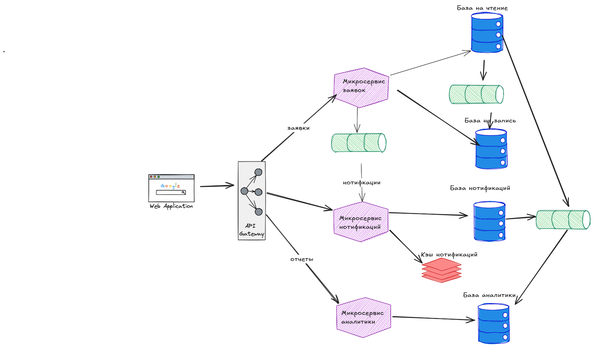

# Проектирование масштабируемой и устойчивой системы для обработки пользовательских заявок

## Цель:

Вы выступаете в роли архитектора, которому поручено разработать высокоуровневую архитектуру системы для обработки заявок
пользователей в онлайн-сервисе. Система должна обеспечивать масштабируемость, надежность и устойчивость при растущей
нагрузке. Необходимо учесть, что в будущем количество пользователей и объём обрабатываемых данных будут увеличиваться.

## Описание/Пошаговая инструкция выполнения домашнего задания:

### Требования к выполнению.

1. Выбор архитектурного стиля:

* Оцените функциональные и нефункциональные требования системы.
* Выберите подходящий архитектурный стиль (монолит, микросервисы, SOA) и обоснуйте ваш выбор.

2. Сбор требований:

* Определите и перечислите ключевые функциональные и нефункциональные требования к системе.
* Укажите основные метрики SLA, SLO и SLI для системы (например, время обработки заявок, процент доступности сервиса,
  допустимое количество ошибок).

3. Применение шаблонов проектирования:

* Предложите применение как минимум двух шаблонов проектирования (например, CQRS для разделения операций чтения и
  записи, Saga для координации выполнения распределённых транзакций).
* Укажите, как выбранные шаблоны помогут решать задачи, связанные с масштабируемостью, устойчивостью и консистентностью
  данных.

4. Кэширование:

* Разработайте стратегию использования кэша для ускорения обработки заявок (например, Cache-Aside или Write-Through).
* Оцените плюсы и минусы предложенной стратегии в контексте требований системы.

5. Результаты.

* Постройте схему архитектуры системы, где будут отражены ключевые компоненты, их взаимодействие и применённые шаблоны.
* Опишите кратко, как архитектура будет масштабироваться при увеличении нагрузки.
* Подготовьте документ, который содержит ваш анализ требований, обоснование выбора архитектурного стиля, описание
  применённых шаблонов и стратегий кэширования.

---

#### 1. Выбор архитектурного стиля

##### Оценка функциональных и нефункциональных требований

- **Функциональные требования:**
    - Поддержка CRUD-операций по запросам пользователей.
    - Обеспечение гарантированной последовательной и уникальной обработки запросов пользователей.
    - Предоставление пользователям обновленной информацию о статусе их заявок.

- **Нефункциональные требования:**
    - Высокая доступность системы (≥99,5%).
    - Масштабируемость системы для обработки не менее чем 100 000 запросов в час.
    - Низкая задержка (≤500 мс для обработки запросов) в режиме операционного окна.
    - Устойчивость к сбоям и возможность автоматического восстановления.

##### Выбранный архитектурный стиль: **Микросервисная архитектура**

**Обоснование:**

- **Масштабируемость:** Микросервисы обеспечивают независимое масштабирование компонентов в зависимости от потребностей
  и рабочих нагрузок.
- **Устойчивость:** Изоляция сбоев от отдельных функциональных областей, реализованных с помощью микросервисов
  предотвращает возникновение единой точки отказа.
- **Гибкость:** Разделение функциональности на разные приложения упрощает добавление новых функций или сервисов, не
  нарушая работу существующих.
- **Удобство обслуживания:** Распределенная архитектура обеспечивает лучшую удобство обслуживания и стратегии
  развертывания.

---

#### 2. Сбор и анализ требований

##### Ключевые требования

- **Функциональные требования:**
    - Управление жизненным циклом заявок: создание, обновление, удаление и просмотр.
    - Управление статусом заявки (например, новая, в обработке, завершена, отклонена).
    - Уведомление пользователей об изменениях статуса заявки.
    - Авторизация и аутентификация пользователей.
    - Возможность поиска и фильтрации заявок.
    - Генерация отчетов об обработке заявок.

- **Нефункциональные требования**:
    - Высокая доступность (например, 99.5%).
    - Низкая задержка (например, <500 мс).
    - Масштабируемость (способность обрабатывать растущее количество заявок).
    - Устойчивость к отказам.
    - Безопасность данных.
    - Простота обслуживания и развертывания.

##### Показатели SLA, SLO и SLI

- **SLA:**
    - Обеспечивают доступность сервиса на 99,5%.
    - Среднее время обработки заявки <500 мс.
- **SLO:**
    - Доля успешных обработок заявок 99.9
    - Максимальная задержка 1000 мс.
- **SLI:**
    - Среднее время отклика API.
    - Процент неудачных или повторных запросов.

---

#### 3. Применение шаблонов проектирования

##### Шаблон 1: **CQRS (Разделение ответственности за команды и запросы).**

- **Описание:**
    - Разделяет операции по созданию и модификации данных (например, создание заявок) от операций чтения (например,
      получение статуса заявки).
    - В шаблоне используется выделенные базы данных для операций чтения и записи.
- ** Преимущества:**
    - Улучшается производительность запросов за счет оптимизации баз данных и моделей данных на стороне чтения.
    - Улучшается масштабируемость для рабочих нагрузок с высокой интенсивностью чтения или записи.

##### Шаблон 2: **Saga (координация распределенных транзакций)**

- **Описание:**
    - Обеспечивает работу бизнес процессов с многоступенчатыми рабочими этапами, такими как создание запроса, его
      обработка и отправка уведомлений.
    - Обеспечивает согласованность между распределенными службами с помощью организованных или хореографических саг.
- **Преимущества:**
    - Повышение производительности чтения/записи благодаря оптимизации.
    - Независимое масштабирование операций чтения и записи.
    - Снижение риска конфликтов при операциях.

---

#### 4. Кэширование

##### Стратегия: **Cache-Aside**

- **Описание:**
    - Сначала данные - ищутся в кэше; если они отсутствуют, они - запрашиваются из базы данных и - помещаются в кэш для
      последующего доступа.
    - Обновление кэша происходит при изменении базы данных.
- **Плюсы:**
    - Уменьшение нагрузки на базу данных за счет использования часто используемых данных из кэша.
    - Обеспечивает гибкость, поскольку при необходимости можно обойти уровень кэша.
- **Минусы:**
    - Потенциальная несогласованность кэша при своевременном обновлении.
    - Усложняет обработку для инвалидации и истечения срока действия данных в кэш.

---

### Результаты

#### Схема архитектуры системы

1. **Шлюз API:**
    - Точка входа для всех клиентских запросов.
    - Направляет запросы к соответствующим микросервисам.
2. **Микросервисы:**
    - **Микросервис заявок:** Занимается созданием, обновлением и управлением жизненным циклом заявок.
    - **Микросервис уведомлений:** Управляет асинхронными уведомлениями.
    - **Микросервис аналитики:** Предоставляет отчеты и аналитику по заявкам.
3. **Брокер сообщений:**
    - Обеспечивает надежную асинхронную связь между микросервисами заявок и уведомлений, в том числе и в
      хореографической саге.
    - Управляет очередями задач для фоновой обработки в мироксервисе уведомлений.
    - Является частью доставки сообщений для CQRS и стримминга данных для аналитики.
4. **Базы данных:**
    - Отдельные базы данных для записи и чтения для реализации CQRS для микросервиса заявок
    - Базы данных для микросервиса аналитики (адаптированная под стримминг и пакетную загрузку данных)
    - База данных для микросервсиа уведомлений адаптированная под OLTP нагрузку
5. **Уровень кэширования:**
    - Кэширование метаданных в распределённом кэше для микросервиса уведомлений.

#### План масштабирования

- Горизонтальное масштабирование:
    - Независимое масштабирование микросервисов в зависимости от их рабочих нагрузок.
    - Используйте контейнеризации совместно с оркестрацией для автоматического масштабирования сервисов.
- Масштабирование баз данных:
    - Использование партиционирования для увеличения нагрузки на базу данных
    - Разделение моделей данных для чтения и записи в паттерне CQRS.
- Балансировка нагрузки:
    - Равномерное распределение входящие запросы по развернутым экземплярам микросервисов, используя API-шлюз со
      встроенной функцией
      балансировки нагрузки.
