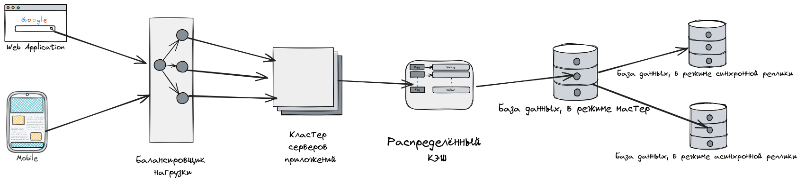
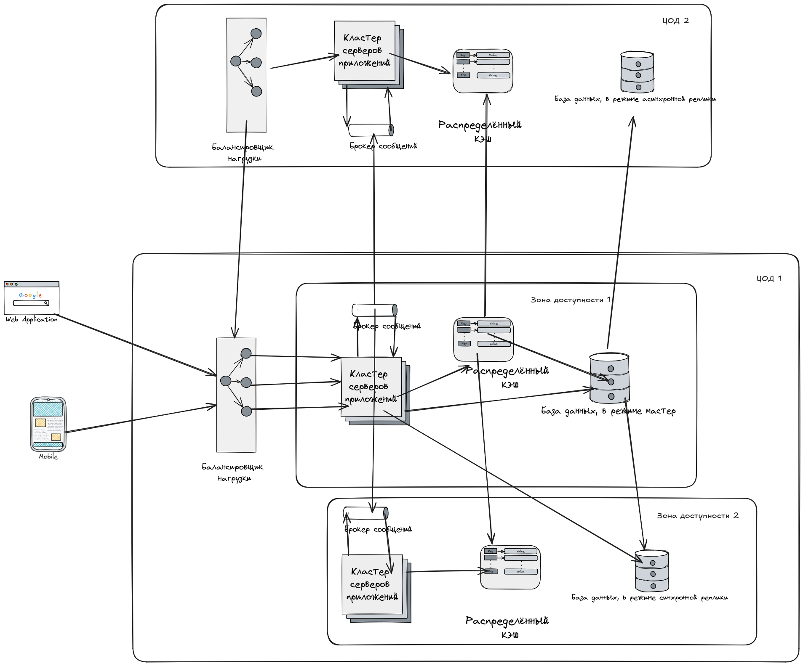
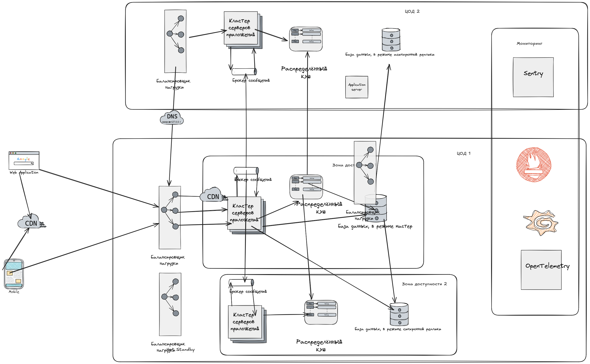

# Проектирование и оптимизация отказоустойчивой и масштабируемой системы

## Цель:

Вам поручено разработать и оптимизировать архитектуру системы, которая должна обрабатывать запросы пользователей с
минимальной задержкой и высокой доступностью. Система должна быть способна справляться с пиковыми нагрузками,
обеспечивать отказоустойчивость и предоставлять стабильный уровень производительности. Вы также должны провести анализ
производительности и предложить улучшения.

## Описание/Пошаговая инструкция выполнения домашнего задания:

### Требования к выполнению.

1. Масштабирование системы:

* Определите и обоснуйте выбор между вертикальным и горизонтальным масштабированием для данной системы.
* Постройте схему архитектуры, отражающую ваш выбор (например, использование шардинга, репликации или кластеризации).
* Укажите, как выбранные принципы масштабирования связаны с CAP-теоремой (например, выбор между согласованностью и
  доступностью).

2. Обеспечение высокой доступности:

* Разработайте архитектуру отказоустойчивой системы с использованием балансировки нагрузки и резервирования
  компонентов.
* Опишите сценарии отказов (например, отказ сервера или базы данных) и укажите, как система должна их обрабатывать.
* Составьте документацию с рекомендациями по обеспечению непрерывной работы системы.

3. Оптимизация производительности:

* Выявите потенциальные узкие места в предложенной архитектуре (например, узкие места при обработке запросов или
  взаимодействии с базой данных).

* Предложите методы оптимизации, включая:
    * Индексацию данных.
    * Переработку запросов (например, добавление лимитов, использование батчей).
    * Применение кэширования (например, кэширование результатов частых запросов).
    * Составьте профиль производительности с анализом узких мест и предложенными улучшениями.

4. Мониторинг и профилирование:

* Разработайте план мониторинга системы (какие метрики собирать, как интерпретировать их значения).
* Предложите инструменты для профилирования и мониторинга (например, Prometheus, Grafana или аналогичные).
* Опишите сценарий анализа метрик производительности и диагностики проблем (например, повышенная задержка или снижение
  throughput).

5. Результаты:

* Диаграмма архитектуры системы, отражающая выбранные подходы к масштабированию, высокой доступности и
  отказоустойчивости.
* Документ с описанием и обоснованием принятых решений, анализом производительности и предложенными методами
  оптимизации.
* Файл с шаблоном профиля производительности и описанием используемых метрик.

---

## Решение

### 1. Масштабирование системы

#### Выбор между вертикальным и горизонтальным масштабированием:

При проектировании системы важно учитывать характерные особенности нагрузки и требования к отказоустойчивости. В случае
данной системы пиковые нагрузки могут быть непредсказуемыми, а высокая доступность и надежность являются ключевыми
факторами. Рассмотрим два основных подхода к масштабированию: вертикальное и горизонтальное.

#### Вертикальное масштабирование:

**Описание:**  
Вертикальное масштабирование заключается в увеличении мощности существующего оборудования, например, путем добавления
процессоров (CPU), оперативной памяти (RAM) или дискового пространства (IO).

**Преимущества:**

- ✅ Простота реализации — не требует значительных изменений в архитектуре.
- ✅ Концентрация ресурсов на одном сервере упрощает управление состоянием и согласованностью данных.

**Недостатки:**

- ❌ Ограниченная масштабируемость из-за физических ограничений оборудования.
- ❌ Высокая стоимость мощного оборудования.
- ❌ Сниженная отказоустойчивость: если единственный сервер выходит из строя, система становится недоступной.

#### Горизонтальное масштабирование:

**Описание:**  
Горизонтальное масштабирование подразумевает добавление новых экземпляров серверов для распределения нагрузки между
ними.

**Преимущества:**

- ✅ Гибкость и возможность легко адаптироваться к росту нагрузки за счет добавления дополнительных узлов.
- ✅ Улучшенная отказоустойчивость благодаря использованию нескольких независимых серверов.
- ✅ Возможность географического распределения узлов для снижения задержек и повышения производительности.

**Недостатки:**

- ❌ Более сложная архитектура требует дополнительных усилий по разработке и поддержке.
- ❌ Необходимость управления состоянием между узлами и обеспечение согласованности данных.
- ❌ Потенциальные проблемы с балансировкой нагрузки при неравномерном распределении запросов.

#### Вывод:

Для системы, которая должна обеспечивать минимальную задержку и высокую доступность, **горизонтальное масштабирование**
является предпочтительным выбором. Оно предоставляет следующие преимущества:

1. **Легкое масштабирование:** Новые узлы можно добавлять без значительных изменений в архитектуре, что особенно важно
   при обработке пиковых нагрузок.
2. **Отказоустойчивость:** Распределение нагрузки между несколькими серверами снижает риск полного выхода системы из
   строя.
3. **Уменьшение задержек:** Географическое распределение узлов позволяет минимизировать время отклика за счет ближайших
   точек обслуживания пользователей.

Таким образом, несмотря на повышенную сложность реализации, горизонтальное масштабирование лучше соответствует
требованиям современных практик проектирования высоконагруженных систем.

#### Схема архитектуры:

#### Выбор между согласованностью (C) и доступностью (A):

- **Реляционные базы данных (SQL)** фокусируются на согласованности и жертвуют доступностью при сетевых сбоях.
- **NoSQL-решения (например, Cassandra)** выбирают доступность, обеспечивая eventual consistency (согласованность в
  конечном итоге).
- В данном проекте, для повышения производительности выбираем баланс между согласованностью и доступностью:
    - Использование eventual consistency (согласованность в конечном счете), чтобы приоритизировать доступность.

### 2. Обеспечение высокой доступности

#### Используемые элементы для построения отказоустойчивой архитектуры:

- **Балансировщик нагрузки**: Один из вариантов инфраструктуры: HAProxy, NGINX, Angie ADC или облачные решения (Yandex
  Network Load Balancer) — балансирует трафик между серверами.
- **Сервера приложений**: Кластер серверов для обработки запросов пользователей, размещенный в 2 ЦОД и 2 зонах
  доступности, в режиме Active-Passive для разных ЦОД и в режиме Warm для разных зон доступности.
- **Репликация базы данных**: Основная база данных + несколько читающих реплик (1 синхронная в другой зоне доступности и
  1 асинхронная в резервном ЦОД), к которым направляются запросы для чтения.
- **Распределённый кэш**: Кэширование часто запрашиваемых данных в Redis, Memcached или аналогах для уменьшения
  нагрузки. Конфигурация в режиме Multi-Master с топологией размещения узлов между разными ЦОД и зонами доступности не
  менее чем в 2 единицах.
- **Брокер сообщений**: Асинхронная обработка (например, через Kafka, RabbitMQ, YDB) для повышения отказоустойчивости.
  Конфигурация в режиме межкластерной репликации не менее чем в 2 единицах в разных ЦОД.

#### Схема архитектуры:

#### Сценарии отказов:

1. **Отказ ЦОД**
    - Приложение переключается на резервный ЦОД через протокол VRRP (Virtual Router Redundancy Protocol) путем
      обновления DNS-записей.
    - Входящие запросы автоматически перенаправляются в резервный ЦОД.

2. **Отказ балансировщика в активном ЦОД**
    - Балансировщик нагрузки переключается на резервную зону доступности по протоколу VRRP.
    - Запросы переадресуются на активные серверы в другой зоне доступности.

3. **Отказ сервера приложения**
    - Балансировщик нагрузки автоматически исключает неисправный сервер из пула обработки.
    - Входящие запросы распределяются только между оставшимися активными узлами.

4. **Отказ базы данных**
    - При выходе из строя основной базы данных чтение и запись переключаются на реплику из другой зоны доступности после
      ее промоушена (Promotion).
    - Реализован механизм автоматического переключения (**Failover**) для минимизации времени простоя.

5. **Перегрузка системы**
    - При достижении предельной нагрузки система начинает возвращать HTTP-ответы с кодом 503 (Service Unavailable),
      сопровождающиеся соответствующими логами перегрузки.
    - Автоматическое динамическое масштабирование узлов серверов приложения через механизмы автоскалинга позволяет
      восстановить нормальную работу системы.

#### Рекомендации по обеспечению непрерывной работы:

1. **Мониторинг и алертинг**
    - **Инструменты мониторинга:**
        - Используйте **Prometheus** для сбора метрик и **Grafana** для визуализации.
        - Настройте мониторинг ключевых показателей: загрузка CPU, памяти, дискового пространства, задержки запросов и
          ошибки.
    - **Алертинг:**
        - Настройте уведомления о критических событиях (например, высокая загрузка CPU, недоступность сервисов).
        - Используйте инструменты, такие как **Alertmanager** или **PagerDuty**, для отправки уведомлений.
    - **Логирование:**
        - Централизованно собирайте логи с помощью **ELK-стека** (Elasticsearch, Logstash, Kibana).
        - Настройте фильтрацию и анализ логов для быстрого обнаружения проблем.

2. **Резервирование и отказоустойчивость**
    - **Резервирование компонентов:**
        - Все ключевые компоненты системы (балансировщик нагрузки, серверы приложения, база данных, кэш) должны быть
          резервированы.
        - Используйте несколько **Availability Zones (AZ)** в облачных провайдерах для географического распределения.
    - **База данных:**
        - Настройте **Master-Slave репликацию** для обеспечения отказоустойчивости.
        - Используйте автоматическое переключение (failover) на Slave-узел при сбое Master.
    - **Кэш:**
        - Используйте кластеризацию для кэша (например, Redis Cluster).
        - Настройте репликацию данных между узлами кэша.
    - **Хранилище файлов:**
        - Используйте распределенное хранилище (например, S3 совместимое хранилище, Ceph) с репликацией данных между
          регионами.

3. **Автоматическое восстановление**
    - **Health Checks:**
        - Настройте Health Checks для всех компонентов системы (серверы приложения, база данных, кэш).
        - Автоматически исключайте неработающие узлы из балансировки нагрузки.
    - **Автоматическое масштабирование:**
        - Настройте Auto Scaling для серверов приложения и баз данных.
        - Добавляйте новые узлы при увеличении нагрузки и удаляйте при снижении.
    - **Резервное копирование:**
        - Регулярно создавайте резервные копии базы данных и критически важных данных.
        - Храните резервные копии в нескольких географических регионах.

### 3. Оптимизация производительности

#### Выявление потенциальных узких мест в архитектуре:

1. **База данных**
    - **Узкие места:**
        - Медленные запросы из-за отсутствия индексов.
        - Высокая нагрузка на Master-узел при записи.
        - Блокировки (locks) при одновременных операциях записи и чтения.
        - Большое количество JOIN-операций и вложенных запросов.
    - **Причины:**
        - Отсутствие индексов для часто используемых полей.
        - Неправильное распределение нагрузки на чтение (не используется репликация).
        - Сложные SQL-запросы с множеством присоединений (joins) или подзапросов.
        - Отсутствие оптимизации запросов (например, выборка большого количества строк без необходимости).

2. **Обработка запросов приложения**
    - **Узкие места:**
        - Высокая загрузка CPU и памяти при обработке запросов.
        - Долгие ответы из-за синхронных операций.
    - **Причины:**
        - Нет кэширования для часто запрашиваемых данных.
        - Отсутствие пагинации или лимитирования результатов запросов.
        - Долгие операции выполняются в основном потоке, блокируя другие запросы.
        - Синхронные вызовы к базе данных или внешним сервисам.

3. **Кэш**
    - **Узкие места:**
        - Неэффективное использование кэша (например, кэширование редко запрашиваемых данных).
        - Истечение срока жизни кэша (TTL) без обновления.
    - **Причины:**
        - Отсутствие стратегии инвалидации кэша.
        - Неправильный выбор данных для кэширования.

4. **Сеть**
    - **Узкие места:**
        - Задержки при передаче данных между серверами.
        - Перегрузка балансировщика нагрузки.
    - **Причины:**
        - Большой объем данных, передаваемых между узлами.
        - Отсутствие CDN для статических файлов.
        - Отсутствие сжатия данных при передаче между серверами.
        - Высокая латентность при взаимодействии с внешними сервисами.

5. **Load Balancer**
    - **Проблема:**
      Балансировщик нагрузки может стать точкой отказа, если он некорректно распределяет запросы.
    - **Причины:**
        - Неравномерное распределение нагрузки между экземплярами приложения.
        - Отсутствие health checks для исключения неисправных экземпляров.

#### Методы оптимизации:

1. **Индексация данных**
    - **Цель:** Ускорить выполнение запросов к базе данных.
    - **Меры:**
        - Создайте индексы для всех полей, которые часто используются в условиях (`WHERE`) или для сортировки (
          `ORDER BY`).
        - Рассмотрите использование составных индексов для запросов с несколькими условиями.
        - Периодически проверяйте статистику использования индексов и удаляйте неиспользуемые индексы.

2. **Переработка запросов**
    - **Цель:** Минимизировать нагрузку на базу данных и улучшить время ответа.
    - **Меры:**
        - **Добавление лимитов:** Используйте `LIMIT` для ограничения количества возвращаемых строк.
        - **Пагинация:** Разбейте большие наборы данных на страницы.
        - **Батчинг запросов:** Группируйте несколько запросов в один.

3. **Кэширование**
    - **Цель:** Снизить нагрузку на базу данных и уменьшить задержку для пользователей.
    - **Меры:**
        - Используйте системы кэширования, такие как Redis или Memcached.
        - Внедрите Content Delivery Network (CDN) для доставки изображений, CSS и JavaScript файлов.

4. **Оптимизация сети**
    - **Цель:** Ускорить передачу данных между компонентами системы.
    - **Меры:**
        - Включите сжатие HTTP-ответов с помощью gzip или brotli.
        - Используйте отдельные серверы или CDN для обслуживания статических файлов.

5. **Оптимизация Load Balancer**
    - **Цель:** Обеспечить равномерное распределение нагрузки.
    - **Меры:**
        - Настройте регулярные проверки состояния экземпляров.
        - Используйте эффективные алгоритмы распределения нагрузки.

### 4. Мониторинг и профилирование

#### План мониторинга системы с учетом кэширования:

1. **Какие метрики собирать?**

**Системные ресурсы**

| Компонент | Описание |
||--|
| **CPU Usage**       | Загрузка процессора на каждом узле (в %)         |
| **Memory Usage**    | Использование оперативной памяти (в % или МБ/ГБ) |
| **Disk I/O**        | Скорость чтения/записи дисков (в МБ/с)           |
| **Network Traffic** | Объем входящего и исходящего трафика (в Мбит/с)  |

**Приложение**

| Параметр          | Описание                                                                                   |
|-------------------|--------------------------------------------------------------------------------------------|
| **Request Rate**  | Количество запросов в секунду, обрабатываемых приложением                                  |
| **Response Time** | Время ответа на запросы (в миллисекундах)                                                  |
| **Error Rate**    | Процент ошибочных запросов относительно общего количества запросов                         |
| **Throughput**    | Объем данных, обработанный за единицу времени (например, количество транзакций в секунду). |

**База данных**

| Параметр                 | Описание                                        |
|--------------------------|-------------------------------------------------|
| **Query Execution Time** | Время выполнения SQL-запросов (в миллисекундах) |
| **Database Connections** | Количество активных соединений с базой данных   |

**Кэширование**

| Параметр                | Описание                                                                                         |
|-------------------------|--------------------------------------------------------------------------------------------------|
| **Cache Hit Ratio**     | Отношение успешных обращений к кэшу к общему числу запросов к кэшу (в %).                        |
| **Cache Miss Rate**     | Процент запросов, которые не были найдены в кэше (в %)                                           |
| **Cache Eviction Rate** | Количество элементов, удаленных из кэша из-за ограничения размера или истечения TTL (в секунду). |
| **Cache Size**          | Текущий объем данных в кэше (в МБ/ГБ)                                                            |
| **Cache Latency**       | Время ответа на запросы к кэшу (в миллисекундах)                                                 |

**Сеть**

| Параметр        | Описание                                                   |
|-----------------|------------------------------------------------------------|
| **Latency**     | Время задержки между клиентом и сервером (в миллисекундах) |
| **Packet Loss** | Процент потерянных пакетов при передаче данных             |

**Интерпретация значений метрик**

| Метрика                  | Описание                                                                                                                               |
|--------------------------|----------------------------------------------------------------------------------------------------------------------------------------|
| **CPU Usage**            | Если загрузка процессора превышает 85% в течение длительного времени, это может указывать  на необходимость масштабирования.           |
| **Memory Usage**         | Высокое использование памяти (>90%) может вызвать проблемы с производительностью.          Необходимо проверить наличие утечек памяти. |
| **Disk I/O**             | Если скорость чтения/записи слишком низкая, это может быть связано с медленным диском или  большим количеством одновременных операций. |
| **Request Rate**         | Низкий request rate может указывать на проблемы с доступностью сервиса.                                                                |
| **Response Time**        | Если время ответа превышает установленный SLA (например, 200 мс), необходимо провести      диагностику.                                |
| **Error Rate**           | Высокий процент ошибок (>1%) требует немедленного анализа                                                                              |
| **Throughput**           | Снижение throughput может быть связано с сетевыми проблемами или перегрузкой сервера.                                                  |
| **Query Execution Time** | Длительное выполнение запросов (>500 мс) требует оптимизации SQL-запросов или индексации.                                              |
| **Cache Hit Ratio**      | Низкий коэффициент попаданий в кэш (<70%) может указывать на неэффективное использование  кэша.                                        |
| **Cache Miss Rate**      | Высокий процент промахов (>30%) может быть вызван недостаточным размером кэша или редко   запрашиваемыми данными.                      |
| **Cache Eviction Rate**  | Если слишком много элементов удаляется из кэша (например, >100 элементов/сек), это может указывать на ограниченность размера кэша.     |
| **Latency**              | Высокая латентность (>100 мс) может быть вызвана проблемами с сетью или расположением    серверов.                                     |

2. **Инструменты для профилирования и мониторинга**

| Технология        | Описание                                                                                          |
|-------------------|---------------------------------------------------------------------------------------------------|
| **Prometheus**    | Система мониторинга с открытым исходным кодом, которая собирает метрики из различных источников.  |
| **Grafana**       | Инструмент для визуализации данных, полученных из Prometheus и других источников.                 |
| **OpenTelemetry** | Открытая спецификация для сбора и передачи трассировок из приложений и инфраструктуры.            |
| **Sentry**        | Служба мониторинга ошибок, которая помогает отслеживать исключения и проблемы в реальном времени. |

3. **Сценарий анализа метрик производительности и диагностики проблем**

| Проблема                | Шаги анализа                                                                                                                                                                                        | Решения                                                                                                                                                                          |
|-------------------------|-----------------------------------------------------------------------------------------------------------------------------------------------------------------------------------------------------|----------------------------------------------------------------------------------------------------------------------------------------------------------------------------------|
| Повышенная задержка     | - Проверьте метрики **Response Time** и **Latency** в Grafana. - Анализируйте **CPU Usage**, **Memory Usage**, **Disk I/O**, **Query Execution Time**, **Cache Hit Ratio**, **Network Traffic**. | - Внедрите кэширование для часто запрашиваемых данных. - Настройте CDN для статического контента. - Рассмотрите возможность использования более быстрого хранилища данных. |
| Снижение throughput     | - Проверьте метрики **Throughput** и **Request Rate** в Prometheus. - Анализируйте **CPU Usage**, **Memory Usage**, **Error Rate**, логи приложения.                                             | - Настройте автоскалинг для добавления новых экземпляров приложения. - Оптимизируйте код приложения, используя профилировщики.                                                |
| Высокий уровень ошибок  | - Проверьте метрику **Error Rate** в New Relic или Grafana. - Анализируйте логи приложения с помощью ELK Stack.                                                                                  | - Исправьте ошибки в коде. - Увеличьте ограничения на количество соединений с базой данных. - Рассмотрите возможность использования retry mechanism.                       |
| Проблемы с кэшированием | - Проверьте метрики **Cache Hit Ratio**, **Cache Miss Rate**, **Cache Eviction Rate**                                                                                                               | - Увеличьте размер кэша. - Оптимизируйте выбор данных для кэширования. - Увеличьте TTL для часто запрашиваемых данных.                                                     |

### 5. Результаты:

#### Диаграмма архитектуры системы

#### Документ с описанием и обоснованием решений

**Выбор подходов к масштабированию**

- **Горизонтальное масштабирование** было выбрано из-за его гибкости и способности эффективно справляться с пиковыми
  нагрузками. Вертикальное масштабирование ограничено физическими возможностями оборудования и менее экономически
  эффективно.
- **Репликация базы данных** обеспечивает отказоустойчивость и ускоряет операции чтения за счет распределения нагрузки
  между несколькими узлами.
- **Шардинг** может быть применен для больших объемов данных, чтобы минимизировать перегрузку одного сервера.

**Обеспечение высокой доступности**

- **Load Balancer** гарантирует равномерное распределение нагрузки и исключение неисправных экземпляров приложения.
- **Автоматическое масштабирование** позволяет динамически добавлять или удалять экземпляры при изменении нагрузки.
- **Резервные копии** создаются регулярно для восстановления данных в случае сбоя.

**Отказоустойчивость**

- **Репликация** и failover mechanism позволяют автоматически переключаться на резервные узлы при выходе из строя
  основного.
- **Кэширование** снижает нагрузку на базу данных и повышает производительность даже при временных сбоях.

**Оптимизация производительности**

- **Индексация данных**: Создание индексов для часто используемых полей в базе данных.
- **Переработка запросов**: Внедрение лимитов, пагинации и батчинга для оптимизации SQL-запросов.
- **Кэширование**: Использование Redis для хранения результатов частых запросов.
- **Асинхронная обработка**: Перемещение долгих операций в фоновые задачи через систему очередей.

#### Файл с шаблоном профиля производительности

**Используемые системные ресурсные метрики**

| Метрика             | Описание                                         |
|---------------------|--------------------------------------------------|
| **CPU Usage**       | Загрузка процессора на каждом узле (в %)         |
| **Memory Usage**    | Использование оперативной памяти (в % или МБ/ГБ) |
| **Disk I/O**        | Скорость чтения/записи дисков (в МБ/с)           |
| **Network Traffic** | Объем входящего и исходящего трафика (в Мбит/с)  |

Приложение

| Метрика           | Описание                                                                                   |
|-------------------|--------------------------------------------------------------------------------------------|
| **Request Rate**  | Количество запросов в секунду, обрабатываемых приложением                                  |
| **Response Time** | Время ответа на запросы (в миллисекундах)                                                  |
| **Error Rate**    | Процент ошибочных запросов относительно общего количества запросов                         |
| **Throughput**    | Объем данных, обработанный за единицу времени (например, количество транзакций в секунду). |

База данных

| Метрика                  | Описание                                        |
|--------------------------|-------------------------------------------------|
| **Query Execution Time** | Время выполнения SQL-запросов (в миллисекундах) |
| **Database Connections** | Количество активных соединений с базой данных   |

Кэширование

| Метрика                 | Описание                                                                                                         |
|-------------------------|------------------------------------------------------------------------------------------------------------------|
| **Cache Hit Ratio**     | Отношение успешных обращений к кэшу к общему числу запросов к кэшу (в %).                                        |
| **Cache Miss Rate**     | Процент запросов, которые не были найдены в кэше (                                      в %)                     |
| **Cache Eviction Rate** | Количество элементов, удаленных из кэша из-за ограничения размера или истечения TTL (в  секунду).                |
| **Cache Size**          | Текущий объем данных в кэше (               в МБ/ГБ)                                                             |
| **Cache Latency**       | Время ответа на запросы к кэшу (в                                                                 миллисекундах) |

Сеть

| Метрика         | Описание                                                   |
|-----------------|------------------------------------------------------------|
| **Latency**     | Время задержки между клиентом и сервером (в миллисекундах) |
| **Packet Loss** | Процент потерянных пакетов при передаче данных             |

**Профиль производительности**

Пример анализа метрик:

| Метрика             | Нормальный уровень | Тревожный уровень |
|---------------------|--------------------|-------------------|
| **CPU Usage**       | <85%               | >85%              |
| **Memory Usage**    | <80%               | >90%              |
| **Response Time**   | ≤200 мс            | >500 мс           |
| **Cache Hit Ratio** | ≥70%               | <50%              |
| **Error Rate**      | ≤1%                | >5%               |

- **Нормальный уровень**: Указывает допустимые значения метрик для нормальной работы системы.
- **Тревожный уровень**: Указывает пороговые значения, превышение которых требует немедленного внимания.

 