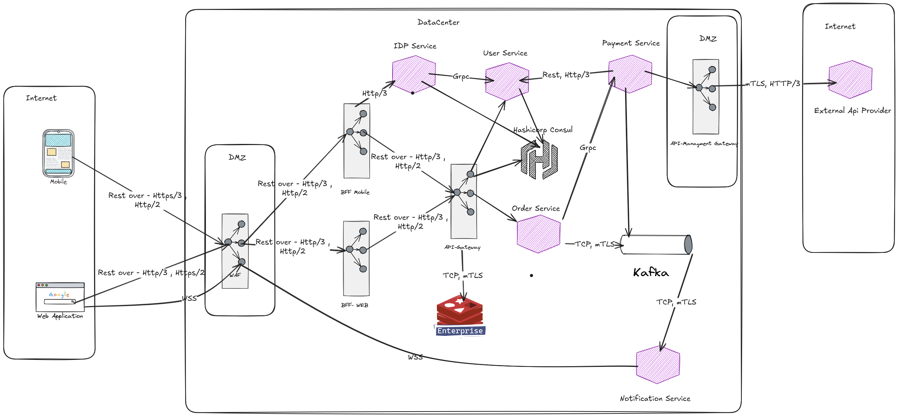
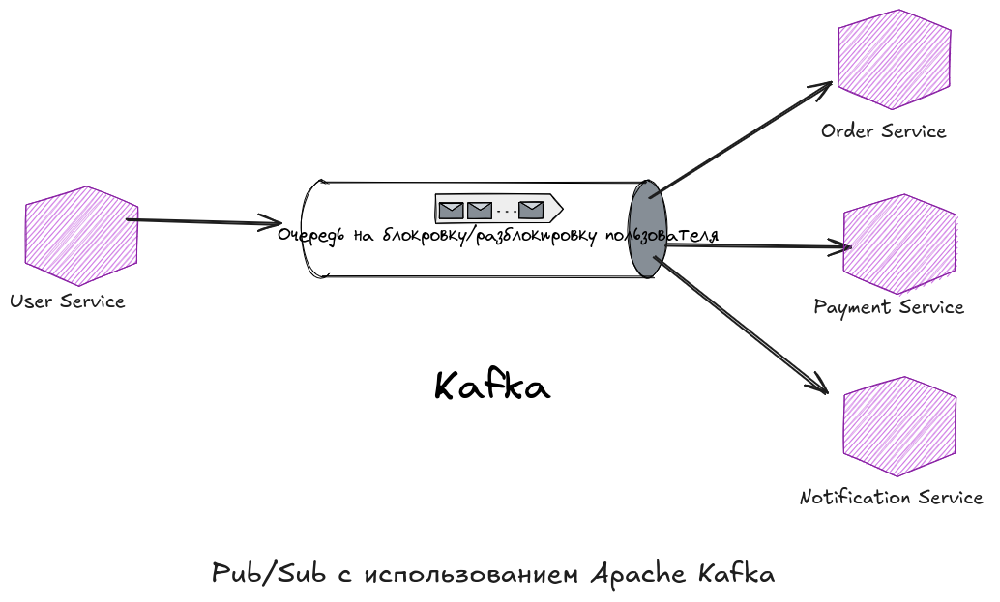
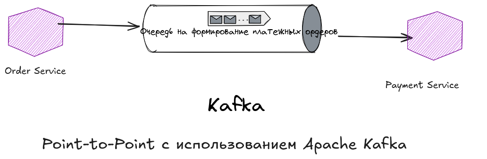

# Проектирование взаимодействия микросервисов с использованием современных сетевых технологий и систем сообщений

## Цель:

Вам нужно спроектировать взаимодействие между микросервисами в распределённой системе с использованием различных сетевых
протоколов, API Gateway и системы сообщений. Задача заключается в создании архитектуры, которая обеспечивает высокую
производительность, масштабируемость, надёжность и гибкость.

## Описание/Пошаговая инструкция выполнения домашнего задания:

### Требования к выполнению.

1. Выбор сетевых протоколов и их интеграция

* Разработайте схему взаимодействия между микросервисами, используя REST, gRPC и WebSockets.
* Обоснуйте выбор протоколов для различных типов взаимодействий (например, запрос-ответ, потоковые данные).
* Предложите интеграцию HTTP/2 или HTTP/3 для повышения производительности, описав, как это улучшит взаимодействие.

2. Проектирование и реализация API

* Спроектируйте RESTful API для одного из микросервисов. Предложите спецификацию API (например, в формате OpenAPI).
* Настройте Service Discovery для автоматического обнаружения микросервисов. Опишите процесс настройки и принцип работы.
* Настройте API Gateway для управления микросервисами. Предложите правила маршрутизации, аутентификации и ограничения
  запросов.

3. Использование систем сообщений

* Выберите и настройте систему сообщений (Apache Kafka или RabbitMQ) для асинхронного взаимодействия между
  микросервисами.
* Реализуйте два сценария:

    * Pub/Sub: Один микросервис публикует обновления, а другие подписываются на них.
    * Point-to-Point: Очередь используется для обработки задач одним из потребителей.

* Опишите конфигурацию и настройку системы сообщений, включая принципы обеспечения надёжности доставки сообщений.

4. Интеграция компонентов

* Постройте общую архитектурную диаграмму, отражающую взаимодействие микросервисов, API Gateway и системы сообщений.
* Опишите, как ваша система справляется с возможными сбоями (например, отказ одного из микросервисов или системы
  сообщений).

5. Мониторинг и отладка

* Опишите, какие метрики вы будете отслеживать для мониторинга системы (например, latency, throughput, error rate).
* Предложите инструменты мониторинга для анализа состояния взаимодействий и системы сообщений.

---

### 1. Выбор сетевых протоколов и их интеграция

#### Общая архитектура системы

Для реализации распределённой системы с высокой производительностью, масштабируемостью и надёжностью предлагается
следующая архитектура:

* API Gateway выступает в качестве единственной точки входа для клиентских запросов.
* Микросервисы общаются между собой через протоколы удалённого вызова - gRPC и Rest.
* Для асинхронного взаимодействия между микросервисами используется система сообщений - Apache Kafka
* HTTP/2 или HTTP/3 применяется для оптимизации производительности.



#### Выбор протоколов и их интеграция

* REST

  Использование: Подходит для простых запросов-ответов, таких как получение информации о пользователях, заказах или
  статусе платежей.

  Пример :
    * GET /users/{id} — получить информацию о пользователе.
    * POST /orders — создать новый заказ.

  Преимущества REST:

    * Простота реализации и поддержка контрактов .
    * Хорошая поддержка в большинстве языков программирования, библиотек и фреймворков.
    * Универсальное использование для клиентов, которые не требуют высокой производительности.


* gRPC

  Использование : Используется для внутренней коммуникации между микросервисами, особенно там, где важен фактор
  производительности и имеются требования по низкая задержка.

  Пример :

    * Order Service вызывает метод ProcessPayment из Payment Service.
    * User Service вызывает метод GetUserDetails из Order Service.

  Преимущества gRPC:

    * Бинарный протокол, что делает его более эффективным по сравнению с текстовым REST.
    * Поддерживает стриминг данных (unary, server-streaming, client-streaming, bidirectional streaming).
    * Автоматическая генерация клиентских библиотек для использования микросервисами.


* WebSockets

  Использование : Используется для потокового взаимодействия, например, отправки уведомлений в реальном времени.

  Пример :
    * Notification Service использует WebSocket для отправки уведомлений на фронтенд.

  Преимущества WebSockets:
    * Позволяет поддерживать постоянное соединение между сервером и клиентом.
    * Идеально подходит для приложений, где требуется мгновенная доставка данных.

#### HTTP/2 или HTTP/3

Использование : HTTP/2 и HTTP/3 можно использовать для оптимизации работы API Gateway и внешних сервисов, BFF и
Frontend.

Преимущества :

* HTTP/2:
    * Мультиплексирование запросов.
    * Сжатие заголовков.
    * Приоритизация потоков.

* HTTP/3:
    * Работает поверх QUIC, что обеспечивает более быстрое восстановление после потери пакетов или переподключения.
    * Независимость потоков от ошибок.

Где применять?

* Между BFF Gateway и фронтендом.
* Между API Gateway и внешними сервисами.

### Проектирование и реализация API

### Спроектированное RESTful API для микросервиса Order Service

Микросервис Order Service управляет заказами в системе. Ниже представлена спецификация API в формате OpenAPI.

<details>
<summary>Спецификация OpenAPI</summary>

```yaml
openapi: 3.0.0
info:
  title: Order Service API
  version: 1.0.0
servers:
  - url: https://api.example.com/orders
paths:
  /orders:
    get:
      summary: Получить список всех заказов пользователя
      parameters:
        - name: userId
          in: query
          required: true
          schema:
            type: string
      responses:
        '200':
          description: Успешный ответ
          content:
            application/json:
              schema:
                type: array
                items:
                  $ref: '#/components/schemas/Order'
    post:
      summary: Создать новый заказ
      requestBody:
        required: true
        content:
          application/json:
            schema:
              $ref: '#/components/schemas/CreateOrderRequest'
      responses:
        '201':
          description: Заказ успешно создан
          content:
            application/json:
              schema:
                $ref: '#/components/schemas/Order'

  /orders/{id}:
    get:
      summary: Получить информацию о заказе по ID
      parameters:
        - name: id
          in: path
          required: true
          schema:
            type: string
      responses:
        '200':
          description: Успешный ответ
          content:
            application/json:
              schema:
                $ref: '#/components/schemas/Order'
        '404':
          description: Заказ не найден

components:
  schemas:
    Order:
      type: object
      properties:
        id:
          type: string
          description: Уникальный идентификатор заказа
        userId:
          type: string
          description: Идентификатор пользователя, создавшего заказ
        status:
          type: string
          description: Статус заказа (например, "pending", "processing", "completed")
        items:
          type: array
          description: Список товаров в заказе
          items:
            type: object
            properties:
              productId:
                type: string
                description: Идентификатор товара
              quantity:
                type: integer
                description: Количество единиц товара
        totalPrice:
          type: number
          description: Общая стоимость заказа
    CreateOrderRequest:
      type: object
      properties:
        userId:
          type: string
          description: Идентификатор пользователя
        items:
          type: array
          description: Список товаров в заказе
          items:
            type: object
            properties:
              productId:
                type: string
                description: Идентификатор товара
              quantity:
                type: integer
                description: Количество единиц товара

```

</details>

<details>
<summary>Код микросервиса Order Service</summary>

```js
const express = require('express');
const router = express.Router();

// Пример базы данных (имитация)
let orders = [
    {
        id: "1",
        userId: "user123",
        status: "в ожидании",
        items: [
            { productId: "product1", quantity: 2 },
            { productId: "product2", quantity: 1 }
        ],
        totalPrice: 1500
    },
    {
        id: "2",
        userId: "user456",
        status: "обрабатывается",
        items: [
            { productId: "product3", quantity: 3 }
        ],
        totalPrice: 3000
    }
];

// Middleware для проверки существования заказа
function getOrderById(req, res, next) {
    const order = orders.find(o => o.id === req.params.id);
    if (!order) {
        return res.status(404).json({ error: "Заказ не найден" });
    }
    req.order = order;
    next();
}

// GET /orders - Получить список всех заказов пользователя
router.get('/orders', (req, res) => {
    const userId = req.query.userId;
    if (!userId) {
        return res.status(400).json({ error: "Необходимо указать параметр userId" });
    }
    const userOrders = orders.filter(order => order.userId === userId);
    res.json(userOrders);
});

// POST /orders - Создать новый заказ
router.post('/orders', (req, res) => {
    const { userId, items } = req.body;

    if (!userId || !items || !Array.isArray(items)) {
        return res.status(400).json({ error: "Некорректные данные запроса" });
    }

    const newOrder = {
        id: String(orders.length + 1), // Генерация уникального ID
        userId,
        status: "в ожидании",
        items,
        totalPrice: items.reduce((total, item) => total + item.quantity * 100, 0) // Простой расчет стоимости
    };

    orders.push(newOrder);
    res.status(201).json(newOrder);
});

// GET /orders/:id - Получить информацию о заказе по ID
router.get('/orders/:id', getOrderById, (req, res) => {
    res.json(req.order);
});

module.exports = router;
```

</details>

#### Настройка Service Discovery

Для автоматического обнаружения микросервисов используется Consul — система для управления конфигурацией и обнаружения
сервисов на основе HashiCorp Consul.
Микросервисы могут быть регистрироваться в Consul при запуске и автоматически обновлять свои адреса через Consul -
используется Server-Side Service Discovery

Процесс настройки :

1. Установка Consul :

* Установить HashiCorp Consul на сервере.
* Запустите Consul в режиме сервера, чтобы он мог хранить информацию о зарегистрированных сервисах.

2. Регистрация микросервисов :

   Каждый микросервис регистрируется в Consul при запуске. используя HTTP API Consul ( Микросервис отправляет
   POST-запрос с информацией о себе (имя, адрес, порт)).

3. Запрос адреса сервиса :

   Когда микросервис или API Gateway хочет взаимодействовать с другим сервисом, он запрашивает адрес через Consul.
   Пример запроса через HTTP API:

  ```bash
    curl http://consul-server:8500/v1/catalog/service/Order%20Service
  ```

Consul возвращает список доступных экземпляров сервиса с их адресами и портами.

4. Интеграция с API Gateway :

* API Gateway настроен на использование Consul для маршрутизации запросов.
* При получении запроса (например, /orders) API Gateway запрашивает адрес Order Service через Consul и перенаправляет
  запрос на соответствующий экземпляр.

#### Настройка API Gateway

API Gateway выступает в качестве точки входа для клиентских запросов от канальных BFF. Он управляет маршрутизацией,
аутентификацией и ограничениями запросов.

Правила маршрутизации :

* /orders/* → Order Service
* /payments/* → Payment Service
* /notifications/* → Notification Service

Аутентификация :

* Используется JWT (JSON Web Tokens) для аутентификации пользователей через IDP (реализация через Keycloak).
* API Gateway проверяет валидность токена перед передачей запроса соответствующему микросервису, через интроспекцию на
  IDP
* API Gateway производит обмен внешнего Access Token на IDP на внутренний JWT. наполняет его данными о пользователе и
  его ролями

Ограничения запросов :

* Лимиты на количество запросов в секунду (Rate Limiting) для предотвращения DDoS-атак.
  Пример: 100 запросов в минуту для каждого пользователя или не более 1000 RPS с одного белого IP

### Использование систем сообщений

#### Выбор системы сообщений

Для реализации обоих сценариев (Pub/Sub и Point-to-Point) будем использовать Apache Kafka . Kafka поддерживает оба типа
взаимодействия благодаря своей гибкой архитектуре:

* Pub/Sub : Используется модель топиков (topics), где один издатель может публиковать сообщения, а несколько подписчиков
  могут их получать.
* Point-to-Point : Реализуется через использование групп потребителей (consumer groups), где каждый экземпляр группы
  получает уникальное сообщение.

##### Сценарий 1: Pub/Sub с использованием Apache Kafka

Микросервис User Service публикует события о блокировке пользователя в топик Kafka. Другие микросервисы (например,
Payment Service , Order Service , Notification Service) подписываются на этот топик для обработки событий.

Преимущества Pub/Sub :

* Масштабируемость: Несколько потребителей могут подписаться на один топик.
* Отказоустойчивость: Kafka хранит сообщения в течение определенного времени, даже если потребители временно недоступны.



##### Сценарий 2: Point-to-Point с использованием Apache Kafka

3.1 Описание сценария

Микросервис Order Service отправляет задачи в топик Kafka. Несколько экземпляров Payment Worker (из микросервиса Payment
Service) объединены в одну группу потребителей (payment-workers), чтобы каждое сообщение обрабатывалось только одним
экземпляром. Payment Worker вычитывает из очереди сообщения и формирует платёжные ордера для оплаты заказов


Преимущества Point-to-Point :

* Гарантированная доставка: Каждое сообщение обрабатывается только одним потребителем из группы.
* Балансировка нагрузки: Kafka автоматически распределяет сообщения между экземплярами группы.

### Интеграция компонентов

#### Общая архитектурная диаграмма

Ниже представлена общая архитектурная схема, отражающая взаимодействие микросервисов, API Gateway и системы сообщений.


#### Сценарии обработки отказов :

В распределённой системе отказ одного из компонентов может повлиять на работу всей платформы. Чтобы минимизировать
влияние сбоев, предложены следующие механизмы:

1. **Отказ одного из микросервисов**

   Сценарий :  Payment Service становится недоступным.

   Меры для устранения:
    * API Gateway :  
      При получении запроса к Payment Service, API Gateway проверяет статус сервиса через Consul .
      Если сервис недоступен, API Gateway возвращает код ошибки (например, HTTP 503 — Service Unavailable).
      Также можно реализовать механизм временной замены ответа или перенаправления запроса на резервный экземпляр
      сервиса.

    * Политика повторных попыток :
      Внедрить механизм retries с экспоненциальным backoff (например, через библиотеку Hystrix или Resilience4j).
      После нескольких неудачных попыток запроса, система переходит в режим "fallback" (например, сохранение заказа без
      обработки платежа).

    * Асинхронная обработка :
      Если Payment Service недоступен, запрос можно отправить в очередь системы сообщений (Kafka). Когда
      сервис восстановится, он автоматически обработает накопленные события.


2. **Отказ системы сообщений (Kafka)**

   Сценарий : Система сообщений выходит из строя.

   Меры для устранения :
    * Репликация данных :
      Использовать репликацию для обеспечения высокой доступности. В Kafka можно настроить несколько брокеров,
      чтобы данные были доступны даже при отказе одного из них или настроить зеркалироваие в другой кластере

    * Буферизация событий :
      Временно сохранять события в локальной базе данных каждого микросервиса (Redis).
      Как только система сообщений восстановится, события будут отправлены в очередь.

    * Мониторинг и оповещение :
      Настроить мониторинг состояния системы сообщений с помощью инструментов (Prometheus и Grafana).
      При обнаружении проблемы отправлять уведомления администраторам для быстрого реагирования.

3. **Отказ API Gateway**

   Сценарий : API Gateway становится недоступным.

   Меры для устранения :
    * Load Balancer :
      Развернуть несколько экземпляров API Gateway за балансировщиком нагрузки (Angie). Это позволит обеспечить высокую
      доступность и распределить нагрузку между экземплярами.

    * Кэширование :
      Использовать кэш для часто запрашиваемых данных (Redis). Если API Gateway недоступен, клиенты могут
      получать данные напрямую из кэша.

    * Отказоустойчивость :
      Настроить автоматическое масштабирование API Gateway в зависимости от нагрузки, чтобы предотвратить перегрузку.


4. **Отказ Service Discovery (Consul)**

   Сценарий : Consul выходит из строя.
   Меры для устранения :
    * Репликация :            Использовать несколько узлов Consul для обеспечения высокой доступности.
    * Кэширование адресов :             Каждый микросервис может кэшировать адреса других сервисов на определенное
      время (например, 5 минут). Если Consul недоступен, микросервис будет использовать закэшированные адреса.
    * Мониторинг :             Настраивать мониторинг состояния Consul и автоматически перезапускать его при
      необходимости.

5. **Общий подход к обработке сбоев**

    * Circuit Breaker :
      Реализовать паттерн Circuit Breaker для защиты микросервисов от каскадных сбоев. Если один микросервис становится
      недоступным, остальные продолжают работать без блокировки.

    * Логирование и трассировка :   Использовать инструменты (OpenTelemetry) для сбора логов и трассировки запросов. Это
      поможет быстро
      выявить причину сбоя.

    * Автоматическое восстановление :   Настроить автоматическую перезагрузку сервисов при их отказе. Это можно сделать
      с помощью оркестраторов контейнеров таких как Kubernetes.

### Мониторинг и отладка

#### Ключевые метрики для мониторинга

Для эффективного мониторинга системы необходимо отслеживать следующие метрики:

Метрики API Gateway

| Метрика            | Описание                                                     | Пример                                                              |
|--------------------|--------------------------------------------------------------|---------------------------------------------------------------------|
| Latency (Задержка) | Время ответа на запрос клиента через API Gateway.            | Среднее время обработки запроса GET /products должно быть ≤ 200 мс. |
| Throughput         | Количество запросов, обрабатываемых API Gateway в секунду.   | API Gateway должен обрабатывать ≥ 1000 запросов/сек.                |
| Error Rate         | Доля запросов, завершившихся с ошибкой (например, HTTP 5xx). | Ошибка должна составлять ≤ 1% от общего числа запросов.             |

Метрики микросервисов

| Метрика                | Описание                                                 | Пример                                                     |
|------------------------|----------------------------------------------------------|------------------------------------------------------------|
| Service Latency        | Время обработки запросов внутри каждого микросервиса.    | Order Service должен обрабатывать запросы ≤ 300 мс.        |
| CPU/Memory Usage       | Использование ресурсов сервера для каждого микросервиса. | CPU не должен превышать 80%, а использование памяти — 70%. |
| Database Query Latency | Время выполнения запросов к базе данных.                 | Запросы к базе данных должны выполняться ≤ 100 мс.         |

Метрики системы сообщений (Kafka/RabbitMQ)

| Метрика            | Описание                                                 | Пример                                             |
|--------------------|----------------------------------------------------------|----------------------------------------------------|
| Message Latency    | Время доставки сообщения от отправителя до получателя.   | Сообщение должно достигать получателя ≤ 500 мс.    |
| Message Throughput | Количество сообщений, обрабатываемых системой в секунду. | Kafka должна обрабатывать ≥ 5000 сообщений/сек.    |
| Queue Length       | Размер очереди непрочитанных сообщений.                  | Размер очереди не должен превышать 1000 сообщений. |
| Message Loss Rate  | Процент потерянных сообщений.                            | Потеря сообщений должна быть ≤ 0.01%.              |

Общие метрики

| Метрика         | Описание                                                          | Пример                                                 |
|-----------------|-------------------------------------------------------------------|--------------------------------------------------------|
| System Uptime   | Время безотказной работы всей системы.                            | Система должна работать ≥ 99.9% времени (SLA = 99.9%). |
| Network Latency | Время передачи данных между микросервисами или через API Gateway. | Средняя сетевая задержка должна быть ≤ 50 мс.          |

#### Инструменты мониторинга

Для анализа состояния взаимодействий между микросервисами и системы сообщений можно использовать следующие инструменты:

Инструменты для мониторинга микросервисов

| Инструмент | Описание                                                        | Функционал                                                                |
|------------|-----------------------------------------------------------------|---------------------------------------------------------------------------|
| Prometheus | Система мониторинга с поддержкой сбора метрик из микросервисов. | Сбор метрик (latency, throughput, error rate), scrape из экспортеров.     |
| Grafana    | Панель управления для визуализации данных Prometheus.           | Создание дашбордов для отображения состояния микросервисов и API Gateway. |
| ELK Stack  | Система для сбора, хранения и анализа логов.                    | Анализ логов для выявления ошибок и трассировки проблем.                  |

Инструменты для мониторинга системы сообщений

| Инструмент               | Описание                                               | Функционал                                                              |
|--------------------------|--------------------------------------------------------|-------------------------------------------------------------------------|
| Confluent Control Center | Инструмент для мониторинга Apache Kafka.               | Отслеживание message latency, throughput, queue length и других метрик. |
| Kafka Manager            | Простой инструмент для управления и мониторинга Kafka. | Мониторинг кластера Kafka.                                              |

Инструменты для трассировки запросов

| Инструмент | Описание                                      | Функционал                                                 |
|------------|-----------------------------------------------|------------------------------------------------------------|
| Jaeger     | Распределённая система трассировки запросов.  | Трассировка полного пути запроса через все микросервисы.   |
| Zipkin     | Альтернатива Jaeger для трассировки запросов. | Интеграция с популярными фреймворками (Spring Boot, gRPC). |

Инструменты для мониторинга сети

| Инструмент | Описание                                                                  | Функционал                                               |
|------------|---------------------------------------------------------------------------|----------------------------------------------------------|
| Datadog    | Комплексный инструмент для мониторинга сети, приложений и инфраструктуры. | Автоматическое обнаружение зависимостей между сервисами. |
| New Relic  | Инструмент с фокусом на APM (Application Performance Monitoring).         | Анализ performance микросервисов и API Gateway.          |
