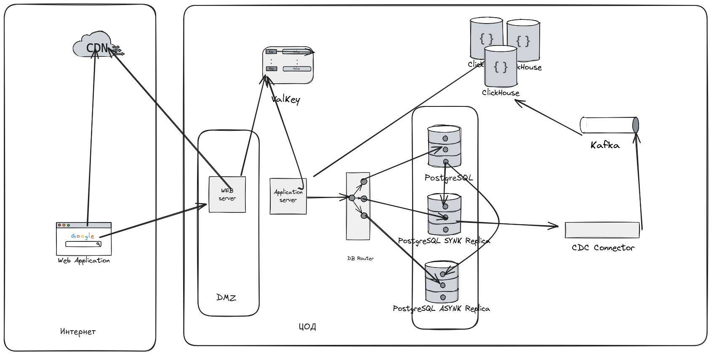
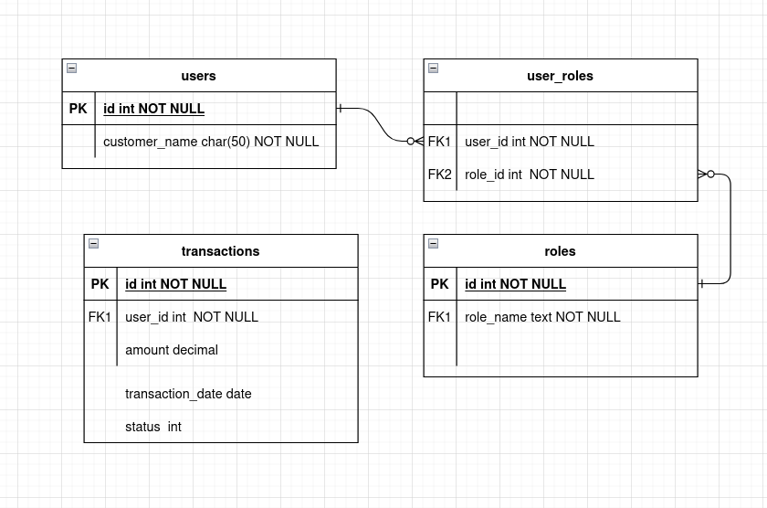

# Проектирование системы хранения данных и повышения производительности с использованием БД, кэша и CDN

## Цель:

Вам предстоит спроектировать систему хранения данных для высоконагруженного веб-приложения, которая сочетает реляционные
или NoSQL базы данных, кэширование и Content Delivery Network (CDN). Задача заключается в создании архитектуры, которая
обеспечивает высокую производительность, масштабируемость и надёжность при одновременной оптимизации затрат.

## Описание/Пошаговая инструкция выполнения домашнего задания:

### Требования к выполнению.

* Выбор и проектирование базы данных

* Определите, какие данные должны храниться в реляционной базе данных, а какие — в NoSQL-хранилище. Обоснуйте выбор для
  каждого из типов данных.
* Разработайте схему базы данных (реляционной или NoSQL) для хранения информации, включающей данные пользователей,
  транзакции, и данные для аналитики.
* Опишите стратегии репликации и шардирования, которые вы выберете для повышения доступности и масштабируемости базы
  данных.

2. Проектирование системы кэширования

* Определите, какие данные будут кэшироваться (например, популярные страницы, пользовательские сессии, результаты
  вычислений).
* Спроектируйте архитектуру кэширования с использованием Redis или Memcached, включая механизмы обновления и сброса
  кэша.
* Опишите, как вы минимизируете риск неконсистентных данных в кэше.

3. Интеграция CDN

* Выберите ресурсы, которые должны быть распределены через CDN (например, изображения, видео, статические файлы).
* Опишите принципы работы с CDN для обеспечения низкой задержки и высокой доступности.
* Разработайте схему взаимодействия между вашим хранилищем данных, кэшем и CDN.


4. Работа с требованиями системы

* Опишите, как ваша архитектура учитывает требования к согласованности, доступности и производительности.
* Приведите примеры, как система справляется с пиковыми нагрузками (например, большой наплыв пользователей).

5. Мониторинг и отладка

* Укажите ключевые метрики для мониторинга базы данных, кэша и CDN.
* Предложите инструменты для мониторинга и выявления узких мест в производительности системы.

---

## Решение



### 1. Выбор и проектирование базы данных

#### Реляционная база данных (RDBMS: PostgreSQL)

**Использование:**

- **Данные пользователей:** Личные данные (имя, email, пароль), роли и привилегии.
- **Транзакции:** Финансовые операции, покупки, статусы заказов.



**Обоснование выбора:**  
Реляционные базы данных обеспечивают строгую согласованность (ACID) и идеально подходят для транзакций, где важно
избегать потери данных или несогласованности. Например, при работе с платежами или заказами.

---

#### NoSQL-хранилище (ClickHouse)

**Использование:**

- **Данные для аналитики:** Логи действий пользователей, транзакции, метрики использования, временные данные для
  машинного обучения.

**Обоснование выбора:**  
NoSQL-базы данных, такие как ClickHouse, отлично подходят для работы с большими объемами неструктурированных или
полуструктурированных данных. Они обеспечивают высокую производительность и масштабируемость за счет отказа от жесткой
схемы данных.

**Схема NoSQL-хранилища (ClickHouse):**

```yaml
"user_id": UInt64,
"amount": Decimal(18, 2),
"product_id": DateTime64(3),
"transaction_date": DateTime
```

---

#### Стратегии репликации и шардирования

- **Репликация:** Для реляционной базы данных используется синхронная и асинхронная репликация для создания нескольких
  копий данных на разных серверах. Это увеличивает доступность и надежность системы.
- **Шардирование:** Для NoSQL-хранилища данные разделяются по ключу, например, `user_id`. Это позволяет распределить
  нагрузку между несколькими узлами и обеспечивает горизонтальное масштабирование. Данные в хранилище заливаются через
  стримминг на основе захвата изменений данных

---

### 2. Проектирование системы кэширования

#### Какие данные будут кэшироваться:

- Популярные страницы: Главная страница, категории товаров, страницы с описанием популярных продуктов.
- Сессии пользователей: Данные о корзине покупок, предпочтениях пользователя или текущем состоянии авторизации.
- Результаты вычислений: Топ-10 товаров, рекомендации для пользователя, статистика посещений.

---

#### Архитектура кэширования:

- **Инструмент:** Используется **Valkey**, так как он поддерживает сложные структуры данных (хеши, списки, множества) и
  предоставляет встроенные механизмы TTL (время жизни данных).
- **Механизмы обновления и сброса кэша:**
    - При изменении данных в базе данных (например, обновление товара или добавление нового продукта) инвалидируется
      соответствующий кэш.
    - Используется паттерн **Cache-Aside**:
        1. Сначала проверяется наличие данных в кэше.
        2. Если данных нет (промах кэша), они загружаются из базы данных.
        3. Загруженные данные сохраняются в кэш для последующих запросов.
    - Для часто изменяемых данных устанавливается небольшое значение TTL, чтобы кэш автоматически обновлялся через
      определенное время.

---

#### Минимизация риска неконсистентных данных:

- **TTL (Time To Live):** Устанавливается время жизни для кэшированных данных, чтобы они автоматически обновлялись через
  определенный интервал.
- **Транзакции в базе данных:** При обновлении данных в базе данных одновременно инвалидируются или обновляются
  соответствующие записи в кэше.
- **Инвалидация кэша:** При изменении данных в базе данных (например, обновление информации о товаре) явно очищаются или
  обновляются связанные записи в кэше.

 

### 3. Интеграция CDN

#### Ресурсы для CDN:

- Статические файлы: CSS, JavaScript, изображения, видео.
- Медиафайлы: Аватарки пользователей, превью товаров.

 

#### Принципы работы с CDN:

- **CDN ( Yandex Cloud CDN):** Кэширует статические файлы на edge-серверах, расположенных близко к пользователям, что
  снижает задержку и уменьшает нагрузку на origin-сервер.
- **Cache-Control заголовки:** Используются заголовки HTTP (например, `Cache-Control`, `Expires`) для управления
  временем жизни кэшированных ресурсов. Это позволяет контролировать, как долго файлы остаются в кэше CDN.
- **Географическое распределение:** CDN размещает копии контента на географически распределенных узлах (Points of
  Presence, POPs), что позволяет обслуживать пользователей из разных регионов с минимальной задержкой.

 

#### Схема взаимодействия:

1. Пользователь запрашивает статический файл (например, изображение).
2. Запрос перенаправляется на ближайший edge-сервер CDN:
    - Если файл уже есть в кэше CDN, он сразу возвращается пользователю.
    - Если файла нет в кэше:
        1. CDN запрашивает файл с origin-сервера (основного хранилища данных).
        2. Полученный файл кэшируется на edge-сервере.
        3. Файл возвращается пользователю.
3. Последующие запросы из того же региона обслуживаются напрямую через CDN, минуя origin-сервер.

 

### 4. Работа с требованиями системы

#### Согласованность:

- Для критически важных данных (например, транзакции) используется строгая согласованность через реляционную базу данных
  с поддержкой ACID.
- Для менее критичных данных (например, аналитика, динамический контент) допускается eventual consistency через
  NoSQL-хранилища.

#### Доступность:

- Репликация и шардирование обеспечивают высокую доступность базы данных за счет распределения данных между несколькими
  узлами.
- CDN повышает доступность статических ресурсов (изображений, видео, CSS, JavaScript), размещая их ближе к
  пользователям.

#### Производительность:

- Кэширование популярных запросов в Valkey снижает нагрузку на базу данных и обеспечивает быстрый отклик для часто
  запрашиваемых данных.
- CDN разгружает серверы, обслуживая статические файлы напрямую из edge-серверов.

#### Способность справляться с пиковыми нагрузками:

- При большом наплыве пользователей:
    - Кэш и CDN берут на себя основную нагрузку, минимизируя количество запросов к базе данных.
    - Автомасштабирование инфраструктуры (например, Kubernetes HPA) позволяет динамически добавлять ресурсы при
      увеличении нагрузки.
    - Очереди сообщений (Kafka) используются для обработки фоновых задач, таких как отправка уведомлений или генерация
      отчетов.

 

### 5. Мониторинг и отладка

#### Ключевые метрики:

- **База данных:**
    - CPU и память: ≤ 80% загрузки.
    - Запросы в секунду: ≥ 10k req/s.
    - Время выполнения запросов: ≤ 50ms.
    - Открытые соединения: ≤ 1000.

- **Кэш:**
    - Hit/Miss Ratio: ≥ 90%.
    - Использование памяти: ≤ 70%.
    - Операции чтения/записи: ≥ 50k ops/s.

- **CDN:**
    - Количество запросов: ≥ 1M req/min.
    - Время отклика: ≤ 100ms.
    - Кэшируемость: ≥ 85%.

 

#### Инструменты мониторинга:

- **Prometheus + Grafana:** Для сбора и визуализации метрик. Prometheus собирает данные, а Grafana предоставляет удобный
  интерфейс для их анализа.
- **New Relic / Datadog:** Для комплексного мониторинга приложения, базы данных и кэша. Эти инструменты позволяют
  отслеживать производительность системы в реальном времени и выявлять узкие места.
- **Yandex Monitoring / Yandex Cloud CDN:** Для мониторинга CDN и облачной инфраструктуры. Особенно полезен для
  наблюдения за состоянием серверов, баз данных и других сервисов.
 
---

 