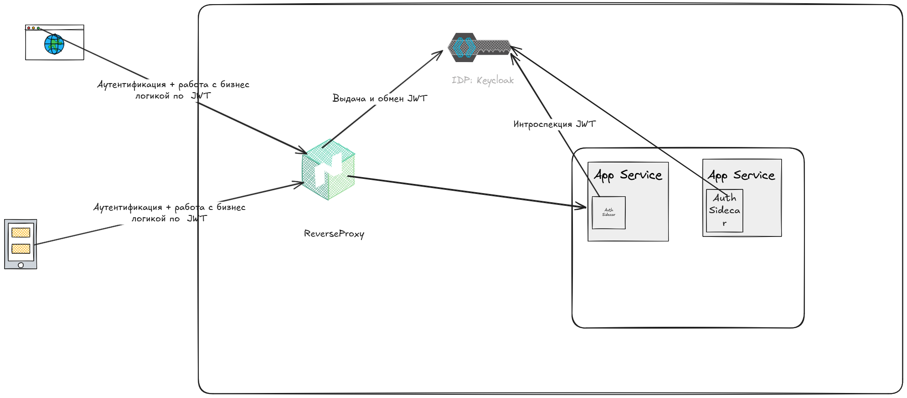
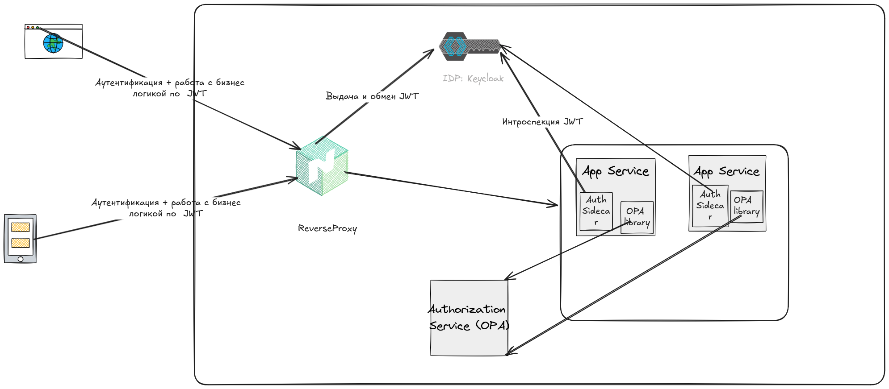
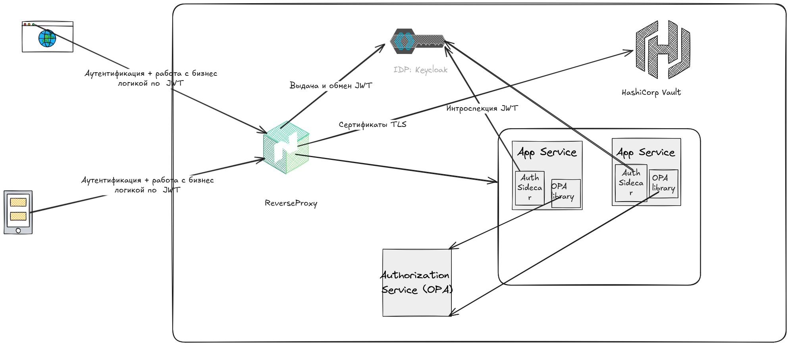
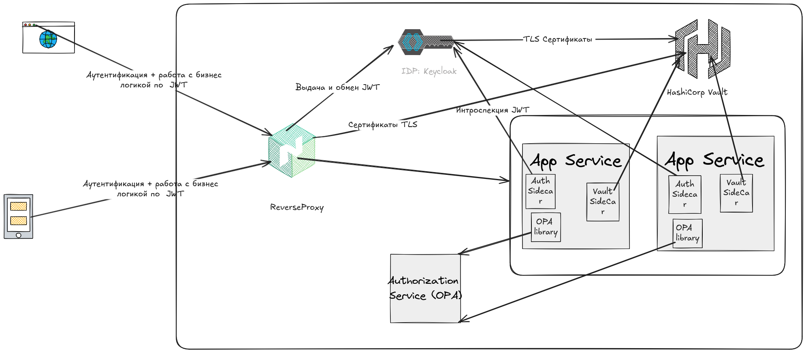
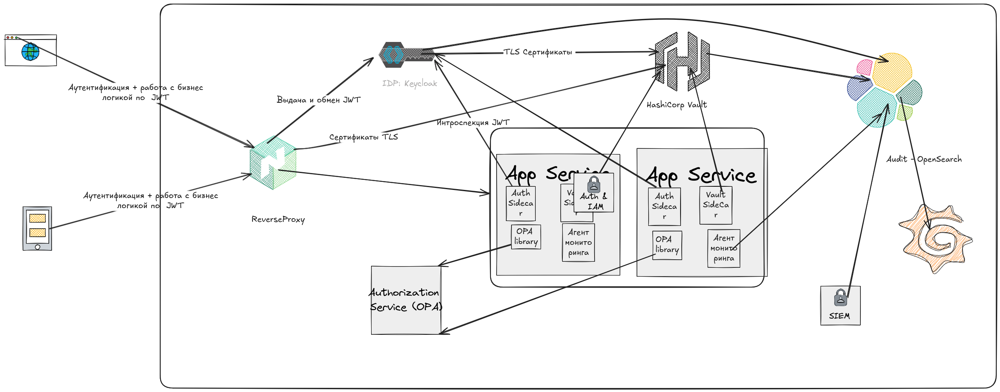

# Проектирование безопасной системы управления доступом и защитой данных

## Цель:

Вам нужно спроектировать безопасную архитектуру системы, включающую механизмы аутентификации, авторизации, защиты данных
при передаче, а также управление секретами. Задача направлена на интеграцию изученных технологий для создания надёжного
и масштабируемого решения, устойчивого к внешним и внутренним угрозам.

## Описание/Пошаговая инструкция выполнения домашнего задания:

### Требования к выполнению.

1. Аутентификация и авторизация

* Выберите подходящий механизм аутентификации и авторизации (OAuth, JWT, SAML) для сценария системы, обслуживающей API и
  веб-клиенты.
* Опишите, как будут выдаваться и проверяться токены доступа.
* Предложите архитектуру, учитывающую сценарии экспирации токенов и их обновления.

2. Безопасность передачи данных

* Спроектируйте использование SSL/TLS для защиты данных в сети, включая ключевые настройки и принципы работы (например,
  HSTS, PFS).
* Определите, какие данные необходимо шифровать, даже в случае защищённого канала, и выберите соответствующий алгоритм
  шифрования.

3. Управление доступами

* Реализуйте модель управления доступом с использованием RBAC или ABAC (например, роли «Администратор», «Пользователь»,
  «Сервис» с различными уровнями прав доступа).
* Опишите процесс добавления и изменения ролей, а также автоматизацию проверки соответствия политик доступа.

4. Хранение и управление секретами

* Выберите инструмент для управления секретами (например, HashiCorp Vault) и спроектируйте схему безопасного хранения
  ключей, паролей, токенов и конфигураций.
* Опишите процесс ротации секретов и шифрования конфигурационных данных.

5. Мониторинг и аудит безопасности

* Спроектируйте механизмы логирования событий безопасности (например, аутентификация, ошибки авторизации, доступ к
  конфиденциальным данным).
* Определите ключевые метрики для мониторинга аномального поведения в системе.

---

### 1. Аутентификация и авторизация

#### Аутентификация пользователя:

* Пользователь отправляет свои учетные данные (логин и пароль) на сервер авторизации через защищенное HTTPS-соединение.
  Для повышения безопасности процесс аутентификации может включать дополнительные факторы, такие как одноразовые
  пароли (OTP), биометрическая аутентификация или подтверждение через мобильное приложение.

* Сервер (в качестве IDP выступает KeyCloak) проверяет предоставленные данные, сравнивая их с хранящимися в базе
  данных (обычно в хэшированном виде). Если
  данные верны, сервер генерирует и возвращает клиенту два токена:

    * Access token (токен доступа): используется для доступа к защищенным ресурсам.
    * Refresh token (токен обновления): используется для получения нового access token после истечения срока его
      действия.

#### Проверка токена доступа:

* **Access token** представляет собой JWT (JSON Web Token), который состоит из трех частей: заголовка (header),
  полезной нагрузки (payload) и подписи (signature). Полезная нагрузка содержит информацию о пользователе (
  идентификатор, текущая организация, срок действия токена).

* При каждом запросе к защищенному ресурсу клиент отправляет access token в заголовке HTTP-запроса (Authorization:
  Bearer <token>).

* На внешнем шлюзе (Angie в качестве Reverse Proxy) выполняется интроспекция токена (проверка его валидности через вызов
  сервера авторизации или локальную проверку подписи). Если токен валиден, происходит его обмен используя IDP (token
  exchange) на
  внутренний токен, который содержит дополнительные атрибуты (claims), необходимые для работы сервисов (например, роли,
  права доступа, идентификатор сессии).

* Сервис приложения проверяет подпись внутреннего токена, его срок действия и атрибуты. На основе этой информации
  выполняется авторизация запроса ( проверка прав доступа к определенному ресурсу).

#### Обновление токенов:

* **Access token** имеет короткий срок жизни (5 минут), чтобы минимизировать риски в случае его утечки. По истечении
  срока
  действия токен становится недействительным.

* **Refresh token** имеет более длительный срок жизни (несколько дней) и хранится в безопасном месте на стороне
  клиента (
  например, в HTTP-only cookie с флагами Secure и SameSite, чтобы предотвратить атаки, такие как XSS и CSRF).

* Для получения нового Access token клиент отправляет Refresh token на специальный endpoint сервера авторизации (
  /token/refresh). IDP проверяет refresh token и, если он валиден, выдает новую пару access token и refresh token.

* В случае компрометации refresh token (например, при утечке), он отзывается на IDP сервере , что сделает его
  недействительным.

### 2. Безопасность передачи данных

#### Использование SSL/TLS

Для защиты данных при передаче между клиентами и сервером используется **SSL/TLS**. Это обеспечивает конфиденциальность,
целостность и аутентификацию соединений.
Выпуск и ротацию сертификатов осуществляет **Certificate Authority** (CA) на базе PKI (Public Key Infrastructure) от
Hashicorp Vault.

##### Ключевые настройки TLS:

- **HSTS (HTTP Strict Transport Security):** Форсирует использование HTTPS во всех запросах клиента.
- **PFS (Perfect Forward Secrecy):** Использует временные ключи для каждой сессии, что делает невозможным расшифровку
  перехваченного трафика даже при компрометации основного приватного ключа сервера.
- **Шифрование:** Рекомендуется использовать современные криптографические алгоритмы ( AES-256-GCM и ECDHE) для обмена
  ключами.

##### Дополнительное шифрование данных:

Особо чувстввительные данные должны быть зашифрованы даже внутри защищенного канала:

- Конфиденциальные данные (например, пароли, персональные данные) шифруются с помощью алгоритмов, таких как AES-256-CBC
  или ChaCha20-Poly1305
- Ключи для шифрования данных хранятся в системе управления секретами (HashiCorp Vault).

### 3. Управление доступами

В данной системе будет использоваться гибридная модель RBAC + ABAC для управления доступом. RBAC определяет роли и
связывает их с разрешениями на выполнение крупногранулярных действий. Для боллее гранулярного доступа будет применятся
модель ABAC

#### Пример ролей:

- **Администратор:** Полный доступ ко всем функциям системы.
- **Пользователь:** Ограниченный доступ к своим данным и общедоступным ресурсам.
- **Сервис:** Доступ только к API для автоматизации задач.

#### Процесс добавления и изменения ролей:

1. Администратор создает новую роль через административную панель.
2. Система проверяет соответствие новой роли политикам безопасности (например, нет противоречий с существующими
   разрешениями).
3. Назначение роли пользователю происходит через интерфейс администратора.

#### Автоматизация проверки политик доступа:

- Разрешения проверяются при каждом запросе к защищенному ресурсу, на наличие допустимой роли.
- Если роль пользователя не имеет необходимых прав, запрос отклоняется с кодом ошибки `403 Forbidden`.
- Проверяется доступ на основе атрибутов у Authorization Service ( Open Policy Agent) через Rego политики. Если сервис
  возвращает ответ о недопустимости доступа, то запрос отклоняется с кодом ошибки `403 Forbidden`.

### 4. Хранение и управление секретами

#### Инструмент управления секретами
Для управления секретами используется **HashiCorp Vault**. Он обеспечивает безопасное хранение ключей, паролей и других чувствительных данных.

#### Схема хранения секретов:
1. Все секреты хранятся в Vault в зашифрованном виде.
2. Доступ к секретам предоставляется через токены с ограниченным временем жизни, выданные аутентификационным сервисом (IDP - Keycloak).
3. Ротация секретов выполняется автоматически по расписанию.

#### Ротация секретов:
- Секреты автоматически обновляются каждые 30 дней.
- При ротации старый секрет остается активным в течение переходного периода (например, 7 дней), чтобы избежать сбоев в работе системы.

#### Шифрование конфигурационных данных:
- Конфигурационные файлы шифруются с помощью алгоритма **AES-256-GCM**.
- Ключ для шифрования хранится в Vault.

### 5. Мониторинг и аудит безопасности

#### Логирование событий безопасности
Все события безопасности записываются в централизованную систему аудита (OpenSearch + OpenSearch DashBoard +):
- Успешная/неуспешная аутентификация.
- Ошибки авторизации.
- Доступ к конфиденциальным данным.
- Изменения ролей и прав доступа.

События безопасности обрабатываются в системе инциндетов SIEM

#### Ключевые метрики для мониторинга:
1. **Частота неудачных попыток входа:**   с сохранением IP, user-agent и времени запроса - gомогает выявить брутфорс-атаки.
2. **Аномальное количество запросов от одного IP:** Может указывать на DDoS-атаку.
3. **Изменение прав доступа:** Необходимо контролировать назначение новых ролей.
4. **Регулярная ротация секретов:** Убедиться, что секреты обновляются в соответствии с политикой.

---