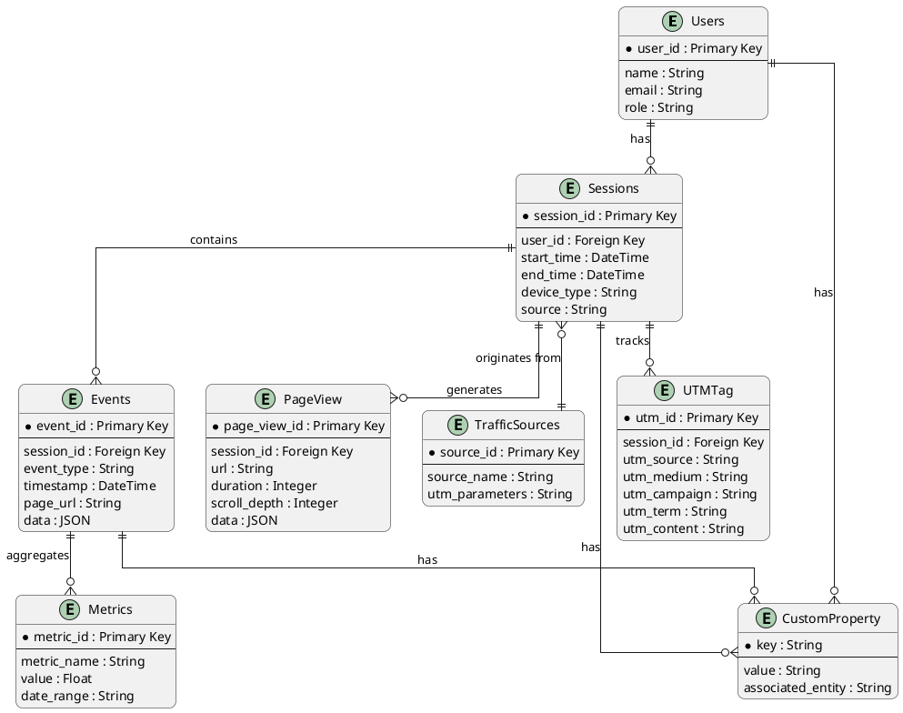
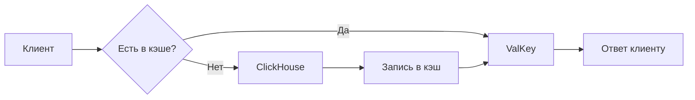

<details>
<summary>Оглавление</summary

1. [Введение](#1-введение)
2. [Требования и ограничения](#2-требования-и-ограничения)
3. [Описание высокоуровневой архитектуры](#3-описание-высокоуровневой-архитектуры)
4. [Архитектура данных для системы веб-аналитики](#4-архитектура-данных-для-системы-веб-аналитики)
5. [Инфраструктура и развертывание](#5-инфраструктура-и-развертывание)
6. [Безопасность](#6-безопасность)
7. [Примеры API](#7-примеры-api)

</details>

## 1. **Введение**

### Название системы:

**WebInsight Analytics**

### Краткое описание:

- WebInsight Analytics — это информационная система, предназначенная для:
    - Сбора, хранения, анализа и визуализации данных о поведении пользователей на веб-сайтах
- Ключевые возможности:
    - Получение актуальных метрик и дашбордов в режиме реального времени
    - Помощь в принятии обоснованных маркетинговых решений
    - Оптимизация пользовательского опыта
    - Инструменты для:
        - Анализа трафика
        - Отслеживания конверсий
        - A/B-тестирования
        - Персонализации контента

### Основная цель системы:

Разработка единого аналитического решения, которое позволяет:

1. Автоматизировать сбор данных с различных источников:
    - Сайты
    - Мобильные приложения
    - CRM-системы
2. Обеспечивать:
    - Точность метрик
    - Актуальность данных в реальном времени
3. Упрощать принятие решений благодаря:
    - Интуитивным отчетам
    - Наглядным дашбордам
4. Соответствовать требованиям:
    - Регуляторных норм
    - Стандартов безопасности

## 2. **Требования и ограничения**

### **2.1. Функциональные требования** *(то, что система должна делать)*

1. **Сбор данных:**
    - Отслеживание метрик посещаемости
    - Сбор данных о действиях пользователей
    - Отслеживание источников трафика
    - Фиксирование событий (клики, отправка форм и др.)

2. **Обработка и анализ данных:**
    - Расчет ключевых метрик
    - Построение воронок продаж
    - Прогнозирование и анализ трендов
    - Система должна хранить исторические данные за период не менее 3 лет.
    - Система должна обеспечивать быструю обработку больших объемов данных (миллионы событий в день).
    - Система должна поддерживать агрегацию данных в реальном времени и в режиме batch-обработки.

3. **Визуализация и отчетность:**
    - Генерация стандартных и настраиваемых отчетов
    - Визуализация данных (графики, диаграммы)
    - Интерактивные дашборды
    - Экспорт данных

4. **Интеграции:**
    - REST API для экспорта/импорта данных
    - Интеграция с CRM, ERP и другими системами
    - Поддержка вебхуков

5. **Уведомления:**
    - Оповещения о значимых изменениях метрик
    - Настраиваемые триггеры для алертов

### **2.2. Нефункциональные требования** *(как система должна работать)*

1. **Производительность:**
    - Хранение исторических данных (глубина хранения данных не менее 3 лет)
    - Обработка больших объемов данных ( от 3 до 5 Гб в час , с пиком 15 Мбит/с )
    - Формирование отчетов за время не более 5 секунд
    - Система обеспечивает минимальное влияние на время загрузки страницы для пользователей с различным качеством
      интернет-соединения.
    - Система должна быть способна одновременно обслуживать не менее **100 активных клиентов**, каждый из которых может
      генерировать до **1000 RPS** (запросов в секунду), что соответствует суммарной нагрузке **до 100 000 RPS**.


2. **Безопасность:**
    - Поддержка мультитенантности данных
    - Многоуровневая система прав доступа
    - Двухфакторная аутентификация
    - Шифрование данных
    - Соответствие национальным стандартам безопасности

3. **Надежность:**
    - Аудит действий пользователей
    - Необходимо выдерживать следующие показатели
        - SLA (Service Level Agreement):
            - Доступность системы: 99.9% в месяц
            - Время отклика API: < 500 мс у 95% запросов
            - Время генерации стандартных отчетов: < 5 секунд

        - RPO (Recovery Point Objective):
            - Потери данных при сбое не превышают 5 минут.
        - RTO (Recovery Time Objective):
            - Восстановление после сбоя занимает менее 15 минут за счет автоматического переключения на резервные
              кластеры и инфраструктуры через Terraform + Ansible.
        - Резервное копирование:
            - Ежедневный бэкап метаданных (PostgreSQL)
            - Архивация сырых событий (ClickHouse → S3) — ежесуточно
            - Резервное копирование
            - Быстрое восстановление после сбоев (время восстановления минимально)

4. **Масштабируемость:**
    - Горизонтальное масштабирование
    - Поддержка работы с большими объемами данных
    - Низкая стоимость масштабирования при росте объема данных или числа пользователей

5. **Пользовательский интерфейс:**
    - Интуитивно понятный интерфейс
    - Мультиязычность
    - Адаптивность под разные устройства
    - Минимальное время отклика системы (например, не более 0,1 секунды в 80% случаев)

6. **Обслуживание:**
    - Регулярные обновления системы
    - Техническая поддержка
    - Наличие документации и обучающих материалов

7. **Эффективность использования ресурсов:**
    - Оптимальная нагрузка на серверы.
    - Энергосбережение при выполнении операций анализа данных

### 2.3 Ограничения системы

1. **Технологические ограничения**
    - Серверные мощности – невозможность обработки данных в реальном времени при высокой нагрузке (более 1 млн
      событий/минуту).
    - Ограничения по производительности инфраструктуры. Горизонтальное масштабирование возможно только за счет
      добавления новых нод, увеличение мощности существующих серверов недоступно.
    - Запрет на использование платных/проприетарных СУБД и сервисов. Все компоненты системы должны быть основаны на
      open-source решениях (например, PostgreSQL, ClickHouse, Valkey, Kafka).
    - Ограничения по типам используемых СУБД. Используются только проверенные и стабильные версии open-source баз
      данных. Выбор конкретного хранилища зависит от назначения:
        - ClickHouse — для хранения и анализа событий.
        - PostgreSQL — для хранения метаданных, пользовательских настроек и ACL.
        - Valkey — для кэширования и работы с временными данными.

2. **Ограничения на сбор данных**
    - Серверные мощности – невозможнос
    - Устаревшие технологии сайтов – невозможность внедрения современных трекеров (например, на сайтах с jQuery 1.x).
    - Блокировка трекеров – Safari (ITP), Firefox (ETP), AdBlock/uBlock Origin скрывают до 30% трафика.
    - Лимиты на частоту сбора – данные отправляются раз в 1-5 минут, а не в реальном времени.

    - Технические ограничения на стороне клиента
        - Поддержка клиентских библиотек — клиентская часть системы (JavaScript SDK) совместима с современными
          браузерами и
          JavaScript-движками, начиная с jQuery 1.5+ и выше, что обеспечивает поддержку большинства существующих
          сайтов.
        - Невозможность интеграции с сильно устаревшими сайтами — на сайтах с критически устаревшими технологиями (
          например,
          без возможности запуска JS) внедрение полноценного сбора данных невозможно.
    - Внешние ограничения (не поддаются контролю со стороны системы)
        - Блокировка трекеров — использование технологий защиты приватности (Safari ITP, Firefox ETP, AdBlock/uBlock
          Origin) может привести к частичной или полной блокировке сбора данных. Это влияет на точность
          метрик, но система не стремится обходить такие ограничения, так как это противоречит политикам приватности и
          законодательству.
        - Неравномерный поток событий — система допускает неравномерное поступление данных от клиентов, вызванное
          различными причинами:
            - задержки в работе браузера,
            - медленное интернет-соединение,
            - использование очередей событий на клиентской стороне.


3. Лимиты на частоту передачи данных

   Данные о действиях пользователей могут передаваться пакетами , с интервалом от 1 до 5 минут в зависимости от
   конфигурации.
   Это сделано для снижения нагрузки на клиентские устройства и экономии трафика, особенно на мобильных устройствах.


3. **Хранение данных**
    - Максимальный срок хранения – 36 месяцев, после чего данные автоматически удаляются.
    - Лимиты на объем – 10 Тб в месяц, далее требуется платное расширение.
    - Скорость записи – требуется система хранения способная справится с пиковыми нагрузками (например, Black Friday).

4. **Интеграции**
    - Ограничения API – Google Analytics, Meta Ads и другие сервисы имеют квоты (например, 10 запросов/секунду).
    - Отсутствие поддержки редких CRM – нет интеграции с нишевыми системами (например, 1С-Битрикс).

5. **Производительность**
    - Задержки отчетов – сложные аналитические запросы выполняются дольше 10 секунд.
    - Ограниченный параллелизм – система не может генерировать более 50 отчетов одновременно.

6. **Регуляторные ограничения**
    - GDPR (ЕС) – обязательное согласие на сбор данных, право на удаление.
    - 152-ФЗ (Россия) – хранение персональных данных только на серверах в РФ.
    - CCPA (Калифорния) – запрет на продажу данных без согласия.

7. **Бюджетные ограничения**
    - Нет денег на коммерческие решения – только бесплатные аналоги (Matomo вместо Adobe Analytics).
    - Ограниченный штат – 10-20 разработчика вместо полноценной команды проекта.

8. **Организационные ограничения**
    - Нехватка экспертов – нет на рынке экспертов для найма по направлению Data Engineer, DevOps, аналитиков.
    - Сопротивление внедрению – сотрудники не хотят переходить на новую систему.

9. **Прочие ограничения**
    - Боты и фейки – до 15% трафика может быть нерелевантным.
    - Кросс-девайс трекинг – нельзя точно связать пользователя на ПК и смартфоне.

## 3. Описание высокоуровневой архитектуры

### Пользователи → Система веб-аналитики

- Пользователи взаимодействуют с системой через **веб-интерфейс** или **API** для:
    - Получения отчетов
    - Анализа данных
    - Настройки параметров

### Веб-сайты и мобильные приложения → Система веб-аналитики

- Веб-сайты и мобильные приложения отправляют данные о поведении пользователей через:
    - JavaScript-теги
    - Пиксели отслеживания
    - Серверные логи

### Сторонние сервисы ↔ Система веб-аналитики

- Интеграция с рекламными платформами (**Google Ads**, **Facebook Ads**) для получения данных о кампаниях.
- Интеграция с **CRM-системами** для анализа поведения клиентов.
- Использование облачных хранилищ (**AWS**, **Google Cloud**) для хранения больших объемов данных.

### API ↔ Система веб-аналитики

- API используется для автоматизации процессов, таких как:
    - Отправка уведомлений
    - Запуск рекламных кампаний


## 4. **Архитектура данных для системы веб-аналитики**

Архитектура данных описывает, как данные организованы, хранятся, обрабатываются и передаются в системе. Она включает
модель данных, выбор СУБД, потоки данных и стратегии кэширования.

### 4.1 Модель данных (описание сущностей и ER-диаграмма

**Описание ключевых сущностей:**

- **PageView** – специализированные события просмотров страниц
- **Conversion** – целевые действия (покупки, лиды)

#### Основные сущности

1. **Пользователи (Users)**
    - Описание: Информация о пользователях системы (анонимные/авторизованные пользователи с кросс-девайс идентификацией)
    - Атрибуты:
        - `user_id` (Primary Key)
        - `name`, `email`, `role` (роль: аналитик, администратор)

2. **Сессии (Sessions)**
    - Описание: Данные о сессиях пользователей на сайте (с тайм-аутом 30 мин)
    - Атрибуты:
        - `session_id` (Primary Key)
        - `user_id` (Foreign Key)
        - `start_time`, `end_time`
        - `device_type` (мобильное устройство, десктоп)
        - `source` (источник трафика: прямой, реклама, соцсети)

3. **События (Events)**
    - Описание: Действия, выполненные пользователем (клики, скроллинг, покупки) с динамическими атрибутами в JSON
    - Атрибуты:
        - `event_id` (Primary Key)
        - `session_id` (Foreign Key)
        - `event_type` (тип события: клик, просмотр страницы)
        - `timestamp`
        - `page_url`
        - `data` (JSON)

4. **PageView**
    - Описание: Специализированные события просмотров страниц
    - Атрибуты:
        - `page_view_id`
        - `session_id`
        - `url`
        - `duration`
        - `scroll_depth`
        - `data` (JSON)

5. **Метрики (Metrics)**
    - Описание: Агрегированные метрики, такие как конверсия, отказы, глубина просмотра
    - Атрибуты:
        - `metric_id` (Primary Key)
        - `metric_name` (название метрики: конверсия, отказы)
        - `value` (значение метрики)
        - `date_range` (временной диапазон)

6. **Источники трафика (Traffic Sources)**
    - Описание: Источники, из которых приходят пользователи
    - Атрибуты:
        - `source_id` (Primary Key)
        - `source_name` (название источника: Google Ads, Facebook Ads)
        - `utm_parameters`

7. **UTMTag**
    - Описание: UTM-метки для отслеживания источников трафика
    - Атрибуты:
        - `utm_id`
        - `session_id` (FK)
        - `utm_source`
        - `utm_medium`
        - `utm_campaign`
        - `utm_term`
        - `utm_content`

8. **CustomProperty**
    - Описание: Пользовательские свойства для различных сущностей
    - Атрибуты:
        - `key`
        - `value`
        - `associated_entity` (user/session/event)

#### ER-диаграмма

<details>
<summary>ER-диаграмма</summary>



</details>


### 4.2 Выбор СУБД (SQL / NoSQL и почему)

#### Гибридный подход

Система использует комбинацию SQL и NoSQL решений для оптимального выполнения различных задач.

#### Выбор реляционной базы данных

**Основная СУБД: ClickHouse**

- **Обоснование:**
    - Большинство сущностей имеют чёткую структуру и отношения (например, пользователи → сессии → события)
    - Требуется поддержка сложных запросов для анализа данных (JOIN, GROUP BY)
    - Необходимость транзакционной целостности (например, при записи данных о сессиях и событиях)
    - Высокая производительность для аналитических запросов
    - Эффективное сжатие данных

**Вторичная (операционная) СУБД: PostgreSQL**

- **Применение:**
    - Управление пользователями и правами доступа
    - Хранение проектов и метаданных
    - Работа с настройками системы
- **Преимущества:**
    - Полноценная поддержка ACID
    - Гибкость и надежность
    - Богатый функционал для работы с метаданными

#### Выбор NoSQL

**Valkey**

- **Назначение:**
    - Кэширование часто запрашиваемых данных
    - Хранение сессионных данных
- **Преимущества:**
    - Экстремально высокая скорость работы
    - Поддержка различных структур данных

### 4.3 Потоки данных / источники / синхронизация

#### Источники данных

1. **Веб-сайты и мобильные приложения**
    - Клиентский сбор данных:
        - JavaScript-теги и пиксели отслеживания (аналог Google Analytics)
        - Серверные логи: Nginx/Apache → Vector → Kafka
    - Пакетная загрузка:
        - Данные из информационных систем партнеров
        - Данные сторонних сервисов

2. **Сторонние сервисы**
    - Рекламные платформы:
        - Яндекс.Директ
        - VK Реклама
    - CRM-системы
    - Социальные сети

#### Потоки данных

1. **Сбор данных**
    - Реалтайм-поток:
        - Клиентские события через API/теги → Kafka
        - Серверные логи: Nginx → Vector → Kafka
    - Пакетная загрузка:
        - ETL-процессы для внешних систем

2. **Обработка данных**
    - Потоковая обработка:
        - Очистка и нормализация через Kafka Streams
    - Пакетная обработка:
        - Агрегация и трансформация через Apache Spark

3. **Хранение данных**
    - Структурированные данные:
        - ClickHouse (оперативные данные и агрегаты)
    - Неструктурированные данные:
        - S3 (сырые данные, архивы)
    - Формат хранения:
        - Parquet для архивных данных

#### Синхронизация данных

| Тип синхронизации | Компоненты                    | Периодичность | Задержка   |
|-------------------|-------------------------------|---------------|------------|
| Реальное время    | События → Kafka → ClickHouse  | Непрерывно    | <1 секунды |
| Агрегация         | ClickHouse Materialized Views | Каждый час    | -          |
| Архивация         | ClickHouse → S3 (Parquet)     | Ежесуточно    | -          | 


<details>
<summary>Диаграмма</summary>



</details>

## 5. Инфраструктура и развертывание

Инфраструктура и развертывание системы веб-аналитики определяют, как система будет работать в целевой среде, какие
инструменты будут использоваться для автоматизации процессов, а также как организованы контейнеризация и оркестрация.

### **5.1. Целевая среда реализации проекта - облако**

#### **Целевая среда: Облако**

- **Обоснование:**
    - Система веб-аналитики требует масштабируемости для обработки больших объемов данных.
    - Необходимость использования облачных сервисов для хранения данных вычислений и анализа.
    - Удобство интеграции с внешними сервисами (Яндекс Директ, Telegram Ads , VK Реклама).

- **Планируемый облачный провайдер: Яндекс.Облако**
    - **Яндекс.Облако:**
        - Хранилище: Yandex Object Storage (S3), Yandex Managed Service for PostgreSQL, Yandex Managed Service for
          ClickHouse, Yandex Managed Service for Valkey.
        - Вычисления: Yandex Managed Service for Kubernetes.
        - Стриминг данных: Yandex Managed Service for Apache Kafka.

- Опционально, **возможно рассмотрение вопроса размещения On-Prem** части вычислительных ресурсов в части холодного
  хранения данных.

### **5.2. CI/CD Pipeline**

**Стек:** GitLab CI + ArgoCD (GitOps)

**Этапы:**

1. **Инфраструктура**
    - Terraform для создания инфраструктуры
    - Yandex Managed Service for Kubernetes - для создания инфраструктуры вычислительных задач
    - GitLab CI + ArgoCD + Helm = (GitOps)

2. **Сборка:**
    - GitLab CI
    - Тестирование кода (unit, интеграционные тесты)
    - Сборка Docker-образов (многоконтейнерная архитектура)
    - Подпись образов (Cosign для безопасности)

3. **Развертывание:** GitLab CD
    - **Canary-деплой** для критичных компонентов (API, ETL)
    - **Blue-Green** для фронтенда (дашборды)
    - Автоматический откат при fail-тестах (Prometheus-мониторинг)

**Особенности:**

- Отдельные пайплайны для:
    - Микросервисов
    - Аналитических задач (Spark Jobs)
- Геораспределение:
    - EU-кластер (основной) + RU-кластер (для данных 152-ФЗ)
    - Репликация: ClickHouse → S3 (межрегиональная sync раз в 1 час)
- Disaster Recovery:
    - RPO <5 мин (Kafka + WAL-логи PostgreSQL + ClickHouse репликация)
    - RTO <15 мин (автоматическое переключение Terraform + Ansible + Helm)

**Поддерживаемые компоненты:**

| Компонент                     | Технология                                   |
|-------------------------------|----------------------------------------------|
| Web Server                    | Angie                                        |
| Collector API                 | Vector                                       |
| Message Queue                 | Yandex Managed Service for Apache Kafka      |
| Stream Processing             | Apache Flink                                 |
| Пакетная обработка данных     | Yandex Managed Service for Apache Airflow    |
| Хранилище событий и агрегатов | Yandex Managed Service for ClickHouse        |
| Холодное хранилище данных     | Yandex Object Storage                        | 
| Админ-интерфейс               | React + API (FastAPI / Nest)                 |
| Bi инструменты                | Yandex DataLens                              |
| Метаданные и ACL              | Yandex Managed Service for PostgreSQL        |
| Кэширование                   | Yandex Managed Service for Valkey            |
| CI/CD                         | Yandex Managed Service for GitLab / ArgoCD   |
| Оркестрация                   | Yandex Managed Service for Kubernetes + Helm |
| IAM                           | Keycloak                                     |
| KMS                           | Yandex Key Management Service                |

---

## 6. Безопасность

Безопасность системы веб-аналитики играет ключевую роль, так как она работает с большими объемами данных, включая
персональные данные пользователей. Далее рассмотрим основные аспекты безопасности: аутентификация, авторизация,
шифрование и стратегии защиты от угроз.

### **6.1. Аутентификация**

#### **Цель:**

Обеспечить проверку подлинности пользователей, которые взаимодействуют с системой (например, аналитиков, маркетологов).

#### **Методы аутентификации:**

1. **OAuth 2.0**
    - **Описание:**
        - OAuth 2.0 используется для безопасного предоставления доступа к API без необходимости передачи учетных данных
          пользователя.
        - Поскольку в Yandex Cloud, нет подходящего OAuth-провайдера, необходимо развернуть свой на базе Keycloak, и
          обеспечить федерацию с некоторыми другими IDP (Identity Provider).
    - **Преимущества:**
        - Удобство для пользователей, как внутренних, так и заказчиков (логин через сторонние сервисы).
        - Защита от утечки паролей.

2. **JWT (JSON Web Token)**
    - **Описание:**
        - JWT — это компактный формат токена, который содержит информацию о пользователе и его правах.
        - Токен передается между клиентом и сервером при каждом запросе.
    - **Преимущества:**
        - Легковесность и возможность передачи по HTTP.
        - Возможность настройки времени жизни токена (TTL).

3. **Многофакторная аутентификация (MFA):**
    - **Описание:**
        - Двухэтапная проверка подлинности (через пароль + SMS-код + TOTP).
    - **Преимущества:**
        - Повышение уровня безопасности для администраторов и других привилегированных пользователей.

### **6.2. Авторизация**

**Цель:**

Ограничить доступ к данным и функциям системы в зависимости от роли или атрибутов пользователя.

**Методы авторизации - гибридная модель (RBAC + ABAC)**

1. **RBAC (Role-Based Access Control):**
    - **Описание:**
        - Контроль доступа на основе ролей (viewer, analyst, admin, developer) и групп (marketing, product, external).
        - Пример: администратор может управлять всеми данными, а аналитик — только просматривать отчеты.
    - **Преимущества:**
        - Простота настройки и управления для администрирования системы.

2. **ABAC (Attribute-Based Access Control):**
    - **Описание:**
        - Контроль доступа на основе атрибутов (по привязанному к заказчику идентификатору рекламной кампании или промо
          кампании).
    - **Преимущества:**
        - Гибкость и точность контроля доступа.

### **6.3. Шифрование**

**Цель:**
Защитить данные от несанкционированного доступа как при передаче, так и при хранении.

**Методы шифрования:**

1. **TLS (Transport Layer Security):**
    - **Описание:**
        - TLS используется для шифрования данных при передаче между клиентом и сервером (TLS 1.3).
    - **Преимущества:**
        - Защита от перехвата данных (MITM-атаки).

2. **AES (Advanced Encryption Standard - AES-256 (GCM)):**
    - **Описание:**
        - AES используется для шифрования данных при хранении (например, логи, персональные данные).
    - **Преимущества:**
        - Высокая производительность и надежность.

3. **KMS (Key Management System):**
    - **Описание:**
        - KMS управляет ключами шифрования, обеспечивая их безопасное хранение и ротацию.
        - Необходимо рассмотреть вариант, использования облачного - Yandex Key Management Service.
    - **Преимущества:**
        - Централизованное управление ключами для всех сервисов.

### **6.4. Стратегии защиты от угроз**

**Основные угрозы и методы защиты:**

1. **SQL-инъекции:**
    - **Защита:**
        - Использование параметризованных запросов.
        - Валидация входных данных.

2. **XSS (Cross-Site Scripting):**
    - **Защита:**
        - Экранирование данных перед выводом на интерфейс.
        - Использование Content Security Policy (CSP).

3. **DDoS-атаки:**
    - **Защита:**
        - Настройка Load Balancer с защитой от DDoS (Yandex Smart Web Security).
        - Ограничение количества запросов на пользователя (Rate Limiting).

4. **Утечка данных:**
    - **Защита:**
        - Анонимизация данных ( хеширование IP-адресов или имен пользователей).
        - Регулярный аудит доступа к данным.

5. **Атаки на API:**
    - **Защита:**
        - Ограничение доступа к API с помощью OAuth 2.0 и JWT.
        - Внедрение WAF (Web Application Firewall) для фильтрации вредоносных запросов.

6. **Компрометация учетных записей:**
    - **Защита:**
        - Использование MFA.
        - Регулярное обновление паролей.

7. **Логирование и мониторинг:**
    - **Защита:**
        - Ведение логов всех действий пользователей.
        - Настройка алертов на подозрительную активность (например, входы из необычных мест).

## 7. Примеры API

<details>
<summary>Пример API</summary>

```JS
POST / api / v1 / track / batch
```

Пример пакетной передачи данных в аналитику от поставщиков

```json
{
  "project_id": "prj_12345",
  "events": [
    {
      "user_id": "usr_67890",
      "session_id": "sess_abcd1234",
      "event_type": "page_view",
      "timestamp": "2025-04-05T14:48:00Z",
      "properties": {
        "url": "https:/yandex.ru/market"
      }
    },
    {
      "user_id": "user-id-9999",
      "session_id": "session_432456",
      "event_type": "click",
      "timestamp": "2025-04-05T14:48:05Z",
      "properties": {
        "element_id": "cta-signup",
        "element_text": "Sign up user"
      }
    }
  ]
}
```

Пример передачи данных в аналитику с фронтенда

```js
fetch('https://analytics.example.com/api/v1/track/event ', {
    method: 'POST',
    headers: {
        'Content-Type': 'application/json',
        'Authorization': 'Client-ID prj_12345'
    },
    body: JSON.stringify({
        user_id: 'usr_67890',
        session_id: 'sess_abcd1234',
        event_type: 'page_view',
        timestamp: new Date().toISOString(),
        properties: {
            url: window.location.href,
            referrer: document.referrer
        }
    })
});

```

</details>

## 8. Узкие места, признаки и решения

<details>
<summary> Потенциально проблемные места в архитектуре и способы их устранения</summary>

| №  | Узкое место                                                                               | Возможные признаки                                                                                      | Решение                                                                                                                                   |
|----|-------------------------------------------------------------------------------------------|---------------------------------------------------------------------------------------------------------|-------------------------------------------------------------------------------------------------------------------------------------------|
| 1  | Kafka как центральная очередь событий                                                     | Задержки в обработке событий, увеличение лага (consumer lag), превышение SLA по времени доставки данных | - Добавление партиций в топики Kafka<br>- Горизонтальное масштабирование Kafka-брокеров<br>- Использование MirrorMaker для резервирования |
| 2  | Несоответствие скорости продюсера и консьюмера в Kafka                                    | Накопление сообщений в очередях, высокая нагрузка на дисковую подсистему                                | - Масштабирование числа консьюмеров<br>- Буферизация через Valkey перед обработкой<br>- Оптимизация ETL-процессов                         |
| 3  | Недостаточное количество партиций в Kafka при высоком RPS                                 | Снижение параллелизма, снижение пропускной способности                                                  | - Расчёт числа партиций по формуле: `RPS × avg. processing time`<br>- Динамическое увеличение партиций при росте нагрузки                 |
| 4  | Сложные JOIN’ы в ClickHouse                                                               | Высокая задержка выполнения запросов, медленное отображение дашбордов                                   | - Предагрегация с Materialized Views<br>- Отказ от JOIN'ов в пользу денормализации<br>- Использование внешних индексов                    |
| 5  | Ограничения PostgreSQL при масштабировании метаданных                                     | Замедление работы UI, долгие операции доступа к ACL                                                     | - Шардинг на уровне приложения<br>- Кэширование прав доступа в Valkey<br>- Использование read-replicas                                    |
| 6  | API Gateway / Collector как точка перегрузки                                              | Повышение latency, ошибки 5xx, потеря данных при пиках                                                  | - Горизонтальное масштабирование коллекторов<br>- Rate-limiting и backpressure<br>- Асинхронная отправка событий                          |
| 7  | Клиентский SDK влияет на производительность страниц сайтов, с которых снимается аналитика | Замедление загрузки страницы, ухудшение LCP метрик                                                      | - Асинхронная загрузка SDK<br>- Lazy-load событий<br>- Минификация кода и использование Web Workers                                       |
| 8  | ETL-процессы и Apache Airflow как ограничивающий фактор batch-обработки                   | Задержки в обновлении агрегатов, ошибки выполнения задач                                                | - Использование KubernetesExecutor<br>- Разделение DAG’ов по worker-группам<br>- Автоматический ребилд DAG’ов                             |
| 9  | Блокировка трекеров расширениями и браузерами (ITP, AdBlock)                              | Потеря до 30% данных, заниженные метрики качества собираемой аналитики                                  | - Прозрачное информирование пользователей о сборе данных<br>- Не бороться с блокировщиками — соблюдать политики приватности               |
| 10 | Недостаточно эффективное кэширование в Valkey                                             | Частые cache misses, повышенная нагрузка на сервисы                                                     | - Использование write-behind кэширования<br>- Разделение кэша по типам данных<br>- Настройка eviction policy под конкретные задачи        |
| 11 | Пиковая нагрузка в моменты массовых событий (например, Черная пятница, Кибер понедельник) | Превышение SLA, сбои в обработке событий                                                                | - Подготовка резервных мощностей<br>- Горизонтальное масштабирование всех компонентов<br>- Load testing перед важными периодами           |

</details>