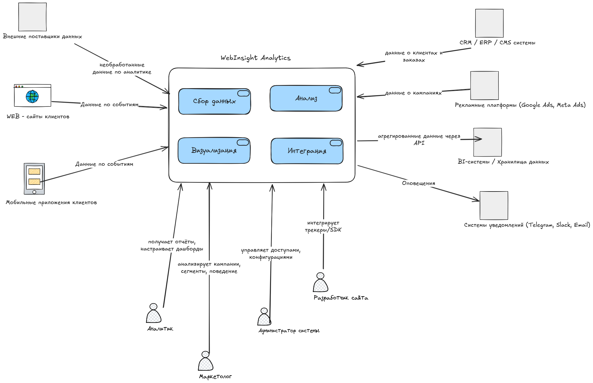
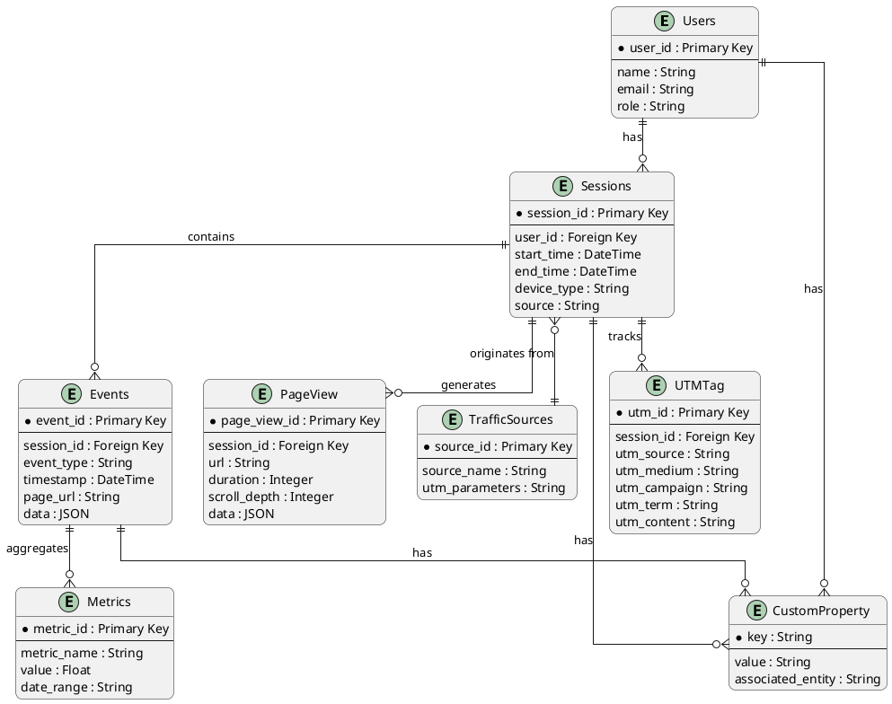
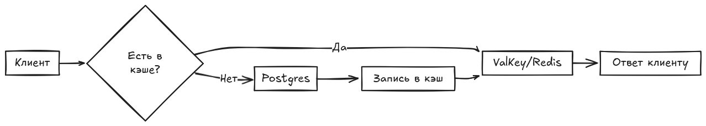
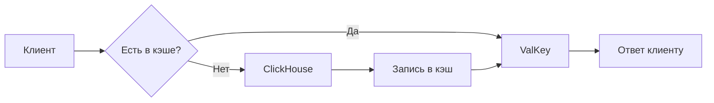

Оглавление

## 1. **Введение**

### Название системы:

**WebInsight Analytics**

### Краткое описание:

- WebInsight Analytics — это информационная система, предназначенная для:
    - Сбора, хранения, анализа и визуализации данных о поведении пользователей на веб-сайтах
- Ключевые возможности:
    - Получение актуальных метрик и дашбордов в режиме реального времени
    - Помощь в принятии обоснованных маркетинговых решений
    - Оптимизация пользовательского опыта
    - Инструменты для:
        - Анализа трафика
        - Отслеживания конверсий
        - A/B-тестирования
        - Персонализации контента

### Основная цель системы:

Разработка единого аналитического решения, которое позволяет:

1. Автоматизировать сбор данных с различных источников:
    - Сайты
    - Мобильные приложения
    - CRM-системы
2. Обеспечивать:
    - Точность метрик
    - Актуальность данных в реальном времени
3. Упрощать принятие решений благодаря:
    - Интуитивным отчетам
    - Наглядным дашбордам
4. Соответствовать требованиям:
    - Регуляторных норм
    - Стандартов безопасности

## 2. **Требования и ограничения**

### **2.1. Функциональные требования** *(то, что система должна делать)*

1. **Сбор данных:**
    - Отслеживание метрик посещаемости
    - Сбор данных о действиях пользователей
    - Отслеживание источников трафика
    - Фиксирование событий (клики, отправка форм и др.)

2. **Обработка и анализ данных:**
    - Расчет ключевых метрик
    - Построение воронок продаж
    - Прогнозирование и анализ трендов
    - Система должна хранить исторические данные за период не менее 3 лет.
    - Система должна обеспечивать быструю обработку больших объемов данных (миллионы событий в день).
    - Система должна поддерживать агрегацию данных в реальном времени и в режиме batch-обработки.

3. **Визуализация и отчетность:**
    - Генерация стандартных и настраиваемых отчетов
    - Визуализация данных (графики, диаграммы)
    - Интерактивные дашборды
    - Экспорт данных

4. **Интеграции:**
    - REST API для экспорта/импорта данных
    - Интеграция с CRM, ERP и другими системами
    - Поддержка вебхуков

5. **Уведомления:**
    - Оповещения о значимых изменениях метрик
    - Настраиваемые триггеры для алертов

### **2.2. Нефункциональные требования** *(как система должна работать)*

1. **Производительность:**
    - Хранение исторических данных (глубина хранения данных не менее 3 лет)
    - Быстрая обработка больших объемов данных
    - Формирование отчетов за время не более 5 секунд
    - Быстрая загрузка страниц вне зависимости от качества сети пользователя.
    - Обработка большого количества одновременных запросов (не менее 1000 запросов в секунду для крупных клиентов)

2. **Безопасность:**
    - Поддержка мультитенантности данных
    - Многоуровневая система прав доступа
    - Двухфакторная аутентификация
    - Шифрование данных
    - Соответствие национальным стандартам безопасности

3. **Надежность:**
    - Аудит действий пользователей
    - Высокая вероятность безотказной работы системы.
    - Резервное копирование
    - Быстрое восстановление после сбоев (время восстановления минимально)

4. **Масштабируемость:**
    - Горизонтальное масштабирование
    - Поддержка работы с большими объемами данных
    - Низкая стоимость масштабирования при росте объема данных или числа пользователей

5. **Пользовательский интерфейс:**
    - Интуитивно понятный интерфейс
    - Мультиязычность
    - Адаптивность под разные устройства
    - Минимальное время отклика системы (например, не более 0,1 секунды в 80% случаев)

6. **Обслуживание:**
    - Регулярные обновления системы
    - Техническая поддержка
    - Наличие документации и обучающих материалов

7. **Эффективность использования ресурсов:**
    - Оптимальная нагрузка на серверы.
    - Энергосбережение при выполнении операций анализа данных

### 2.3 Ограничения системы

1. **Технологические ограничения**
    - Серверные мощности – невозможность обработки данных в реальном времени при высокой нагрузке (более 1 млн
      событий/минуту).
    - Горизонтальное масштабирование – не возможно увеличивать серверный мощности выделенных серверов, возможно только
      горизонтальное масштабирование.
    - Использование только open-source – запрет на коммерческие решения (например, только PostgreSQL вместо ClickHouse).

2. **Ограничения на сбор данных**
    - Серверные мощности – невозможнос
    - Устаревшие технологии сайтов – невозможность внедрения современных трекеров (например, на сайтах с jQuery 1.x).
    - Блокировка трекеров – Safari (ITP), Firefox (ETP), AdBlock/uBlock Origin скрывают до 30% трафика.
    - Лимиты на частоту сбора – данные отправляются раз в 1-5 минут, а не в реальном времени.

3. **Хранение данных**
    - Максимальный срок хранения – 36 месяцев, после чего данные автоматически удаляются.
    - Лимиты на объем – 10 Тб в месяц, далее требуется платное расширение.
    - Скорость записи – требуется система хранения сопобная справится с пиковыми нагрузками (например, Black Friday).

4. **Интеграции**
    - Ограничения API – Google Analytics, Meta Ads и другие сервисы имеют квоты (например, 10 запросов/секунду).
    - Отсутствие поддержки редких CRM – нет интеграции с нишевыми системами (например, 1С-Битрикс).

5. **Производительность**
    - Задержки отчетов – сложные аналитические запросы выполняются дольше 10 секунд.
    - Ограниченный параллелизм – система не может генерировать более 50 отчетов одновременно.

6. **Регуляторные ограничения**
    - GDPR (ЕС) – обязательное согласие на сбор данных, право на удаление.
    - 152-ФЗ (Россия) – хранение персональных данных только на серверах в РФ.
    - CCPA (Калифорния) – запрет на продажу данных без согласия.

7. **Бюджетные ограничения**
    - Нет денег на коммерческие решения – только бесплатные аналоги (Matomo вместо Adobe Analytics).
    - Ограниченный штат – 10-20 разработчика вместо полноценной команды проекта.

8. **Организационные ограничения**
    - Нехватка экспертов – нет на рынке экспертов для найма по направлению Data Engineer, DevOps, аналитиков.
    - Сопротивление внедрению – сотрудники не хотят переходить на новую систему.

9. **Прочие ограничения**
    - Боты и фейки – до 15% трафика может быть нерелевантным.
    - Кросс-девайс трекинг – нельзя точно связать пользователя на ПК и смартфоне.

## 3. Описание высокоуровневой архитектуры

### Пользователи → Система веб-аналитики

- Пользователи взаимодействуют с системой через **веб-интерфейс** или **API** для:
    - Получения отчетов
    - Анализа данных
    - Настройки параметров

### Веб-сайты и мобильные приложения → Система веб-аналитики

- Веб-сайты и мобильные приложения отправляют данные о поведении пользователей через:
    - JavaScript-теги
    - Пиксели отслеживания
    - Серверные логи

### Сторонние сервисы ↔ Система веб-аналитики

- Интеграция с рекламными платформами (**Google Ads**, **Facebook Ads**) для получения данных о кампаниях.
- Интеграция с **CRM-системами** для анализа поведения клиентов.
- Использование облачных хранилищ (**AWS**, **Google Cloud**) для хранения больших объемов данных.

### API ↔ Система веб-аналитики

- API используется для автоматизации процессов, таких как:
    - Отправка уведомлений
    - Запуск рекламных кампаний

## 4. **Архитектура данных для системы веб-аналитики**

Архитектура данных описывает, как данные организованы, хранятся, обрабатываются и передаются в системе. Она включает
модель данных, выбор СУБД, потоки данных и стратегии кэширования.

### 4.1 Модель данных (описание сущностей и ER-диаграмма

**Описание ключевых сущностей:**

- **PageView** – специализированные события просмотров страниц
- **Conversion** – целевые действия (покупки, лиды)

#### Основные сущности

1. **Пользователи (Users)**
    - Описание: Информация о пользователях системы (анонимные/авторизованные пользователи с кросс-девайс идентификацией)
    - Атрибуты:
        - `user_id` (Primary Key)
        - `name`, `email`, `role` (роль: аналитик, администратор)

2. **Сессии (Sessions)**
    - Описание: Данные о сессиях пользователей на сайте (с тайм-аутом 30 мин)
    - Атрибуты:
        - `session_id` (Primary Key)
        - `user_id` (Foreign Key)
        - `start_time`, `end_time`
        - `device_type` (мобильное устройство, десктоп)
        - `source` (источник трафика: прямой, реклама, соцсети)

3. **События (Events)**
    - Описание: Действия, выполненные пользователем (клики, скроллинг, покупки) с динамическими атрибутами в JSON
    - Атрибуты:
        - `event_id` (Primary Key)
        - `session_id` (Foreign Key)
        - `event_type` (тип события: клик, просмотр страницы)
        - `timestamp`
        - `page_url`
        - `data` (JSON)

4. **PageView**
    - Описание: Специализированные события просмотров страниц
    - Атрибуты:
        - `page_view_id`
        - `session_id`
        - `url`
        - `duration`
        - `scroll_depth`
        - `data` (JSON)

5. **Метрики (Metrics)**
    - Описание: Агрегированные метрики, такие как конверсия, отказы, глубина просмотра
    - Атрибуты:
        - `metric_id` (Primary Key)
        - `metric_name` (название метрики: конверсия, отказы)
        - `value` (значение метрики)
        - `date_range` (временной диапазон)

6. **Источники трафика (Traffic Sources)**
    - Описание: Источники, из которых приходят пользователи
    - Атрибуты:
        - `source_id` (Primary Key)
        - `source_name` (название источника: Google Ads, Facebook Ads)
        - `utm_parameters`

7. **UTMTag**
    - Описание: UTM-метки для отслеживания источников трафика
    - Атрибуты:
        - `utm_id`
        - `session_id` (FK)
        - `utm_source`
        - `utm_medium`
        - `utm_campaign`
        - `utm_term`
        - `utm_content`

8. **CustomProperty**
    - Описание: Пользовательские свойства для различных сущностей
    - Атрибуты:
        - `key`
        - `value`
        - `associated_entity` (user/session/event)

#### ER-диаграмма

ER-диаграмма

### 4.2 Выбор СУБД (SQL / NoSQL и почему)

#### Гибридный подход

Система использует комбинацию SQL и NoSQL решений для оптимального выполнения различных задач.

#### Выбор реляционной базы данных

**Основная СУБД: ClickHouse**

- **Обоснование:**
    - Большинство сущностей имеют чёткую структуру и отношения (например, пользователи → сессии → события)
    - Требуется поддержка сложных запросов для анализа данных (JOIN, GROUP BY)
    - Необходимость транзакционной целостности (например, при записи данных о сессиях и событиях)
    - Высокая производительность для аналитических запросов
    - Эффективное сжатие данных

**Вторичная (операционная) СУБД: PostgreSQL**

- **Применение:**
    - Управление пользователями и правами доступа
    - Хранение проектов и метаданных
    - Работа с настройками системы
- **Преимущества:**
    - Полноценная поддержка ACID
    - Гибкость и надежность
    - Богатый функционал для работы с метаданными

#### Выбор NoSQL

**Valkey**

- **Назначение:**
    - Кэширование часто запрашиваемых данных
    - Хранение сессионных данных
- **Преимущества:**
    - Экстремально высокая скорость работы
    - Поддержка различных структур данных

### 4.3 Потоки данных / источники / синхронизация

#### Источники данных

1. **Веб-сайты и мобильные приложения**
    - Клиентский сбор данных:
        - JavaScript-теги и пиксели отслеживания (аналог Google Analytics)
        - Серверные логи: Nginx/Apache → Vector → Kafka
    - Пакетная загрузка:
        - Данные из информационных систем партнеров
        - Данные сторонних сервисов

2. **Сторонние сервисы**
    - Рекламные платформы:
        - Яндекс.Директ
        - VK Реклама
    - CRM-системы
    - Социальные сети

#### Потоки данных

1. **Сбор данных**
    - Реалтайм-поток:
        - Клиентские события через API/теги → Kafka
        - Серверные логи: Nginx → Vector → Kafka
    - Пакетная загрузка:
        - ETL-процессы для внешних систем

2. **Обработка данных**
    - Потоковая обработка:
        - Очистка и нормализация через Kafka Streams
    - Пакетная обработка:
        - Агрегация и трансформация через Apache Spark

3. **Хранение данных**
    - Структурированные данные:
        - ClickHouse (оперативные данные и агрегаты)
    - Неструктурированные данные:
        - S3 (сырые данные, архивы)
    - Формат хранения:
        - Parquet для архивных данных

#### Синхронизация данных

| Тип синхронизации | Компоненты                    | Периодичность | Задержка   |
|-------------------|-------------------------------|---------------|------------|
| Реальное время    | События → Kafka → ClickHouse  | Непрерывно    | <1 секунды |
| Агрегация         | ClickHouse Materialized Views | Каждый час    | -          |
| Архивация         | ClickHouse → S3 (Parquet)     | Ежесуточно    | -          | 

Диаграмма

## 5. Инфраструктура и развертывание

Инфраструктура и развертывание системы веб-аналитики определяют, как система будет работать в целевой среде, какие
инструменты будут использоваться для автоматизации процессов, а также как организованы контейнеризация и оркестрация.

### **5.1. Целевая среда реализации проекта - облако**

#### **Целевая среда: Облако**

- **Обоснование:**
    - Система веб-аналитики требует масштабируемости для обработки больших объемов данных.
    - Необходимость использования облачных сервисов для хранения данных вычислений и анализа.
    - Удобство интеграции с внешними сервисами (Яндекс Директ, Telegram Ads , VK Реклама).

- **Планируемый облачный провайдер: Яндекс.Облако**
    - **Яндекс.Облако:**
        - Хранилище: Yandex Object Storage (S3), Yandex Managed Service for PostgreSQL, Yandex Managed Service for
          ClickHouse, Yandex Managed Service for Valkey.
        - Вычисления: Yandex Managed Service for Kubernetes.
        - Стриминг данных: Yandex Managed Service for Apache Kafka.

- Опционально, **возможно рассмотрение вопроса размещения On-Prem** части вычислительных ресурсов в части холодного
  хранения данных.

### **5.2. CI/CD Pipeline**

**Стек:** GitLab CI + ArgoCD (GitOps)

**Этапы:**

1. **Инфраструктура**
    - Terraform для создания инфраструктуры
    - Yandex Managed Service for Kubernetes - для создания инфраструктуры вычислительных задач
    - GitLab CI + ArgoCD + Helm = (GitOps)

2. **Сборка:**
    - GitLab CI
    - Тестирование кода (unit, интеграционные тесты)
    - Сборка Docker-образов (многоконтейнерная архитектура)
    - Подпись образов (Cosign для безопасности)

3. **Развертывание:** GitLab CD
    - **Canary-деплой** для критичных компонентов (API, ETL)
    - **Blue-Green** для фронтенда (дашборды)
    - Автоматический откат при fail-тестах (Prometheus-мониторинг)

**Особенности:**

- Отдельные пайплайны для:
    - Микросервисов
    - Аналитических задач (Spark Jobs)
- Геораспределение:
    - EU-кластер (основной) + RU-кластер (для данных 152-ФЗ)
    - Репликация: ClickHouse → S3 (межрегиональная sync раз в 1 час)
- Disaster Recovery:
    - RPO <5 мин (Kafka + WAL-логи PostgreSQL + ClickHouse репликация)
    - RTO <15 мин (автоматическое переключение Terraform + Ansible + Helm)

**Поддерживаемые компоненты:**

| Компонент                     | Технология                                   |
|-------------------------------|----------------------------------------------|
| Web Server                    | Angie                                        |
| Collector API                 | Vector                                       |
| Message Queue                 | Yandex Managed Service for Apache Kafka      |
| Stream Processing             | Apache Flink                                 |
| Пакетная обработка данных     | Yandex Managed Service for Apache Airflow    |
| Хранилище событий и агрегатов | Yandex Managed Service for ClickHouse        |
| Холодное хранилище данных     | Yandex Object Storage                        | 
| Админ-интерфейс               | React + API (FastAPI / Nest)                 |
| Bi инструменты                | Yandex DataLens                              |
| Метаданные и ACL              | Yandex Managed Service for PostgreSQL        |
| Кэширование                   | Yandex Managed Service for Valkey            |
| CI/CD                         | Yandex Managed Service for GitLab / ArgoCD   |
| Оркестрация                   | Yandex Managed Service for Kubernetes + Helm |

